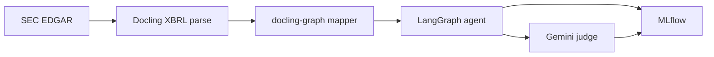

# Graph-Grounded Agentic Retrieval over XBRL Financial Disclosures

Answer natural-language questions over SEC **10-K** and **10-Q** filings by turning EDGAR **XBRL** into a navigable knowledge graph ([Docling](https://github.com/docling-project/docling) + [docling-graph](https://github.com/docling-project/docling-graph)), running a **LangGraph** agent that binds filings and extracts evidence, and auditing every answer with a **Gemini** trajectory judge. Local reasoning uses **LM Studio** (OpenAI-compatible API).

This repo implements the research direction in [docs/research-proposal.md](docs/research-proposal.md).

---

## What this repository does

| Workflow | You get | Live models |
|----------|---------|-------------|
| **Interactive Q&A** (`materialize` + `ask`) | One issuer, one question, answer + MLflow trace | LM Studio (agent) + Gemini (judge on each `ask`) |
| **Paper reproduction** (`benchmark-dataset` + `repro`) | Five system variants on the **custom-judge v2.0** benchmark (200 items), exported CSV tables + HTML report | Phase 1: EDGAR + Gemini (item authoring). Phase 2: LM Studio (graph variants) + Gemini (judge) + MiniLM (`flat-chunk` only) |

**Documentation map**

| Doc | When to read it |
|-----|-----------------|
| [End-to-end walkthrough](docs/end-to-end-walkthrough.md) | First deep dive: XBRL, Docling, graph, agent stages, judge |
| [Research reproduction](docs/research-reproduction.md) | Full paper repro: two phases, variants, defer-judge, recovery |
| [Custom-judge dataset generation](docs/custom-judge-dataset-generation.md) | Building the evaluation corpus — v1.x and **v2.0** (phase 1 of paper repro) |
| [docs/README.md](docs/README.md) | Index of all guides |

---

## Prerequisites

- **Python 3.12+** and [uv](https://docs.astral.sh/uv/)
- **[LM Studio](https://lmstudio.ai/)** — local server on `http://localhost:1234/v1`, context length matching `configs/lm_studio.yaml` (e.g. `16384`)
- **`.env`** — copy from `.env.example`:

| Variable | Interactive `ask` | Paper repro phase 2 |
|----------|-------------------|---------------------|
| `SEC_EDGAR_USER_AGENT` | Yes (`Name email@domain`) | Phase 1 only |
| `GOOGLE_API_KEY` | Yes (trajectory judge) | Yes (judge; phase 1 item authoring) |
| `USE_MOCK_LLM=0` | Live agent | Live agent (graph variants) |
| `USE_MOCK_JUDGE=0` | Live judge | Live judge |
| `OFFLINE_BENCHMARK=1` | No | **Yes** (frozen bundle; no EDGAR during eval) |

```bash
git clone <repo-url> && cd agentic-graphrag-finance
uv sync --locked
cp .env.example .env   # edit SEC_EDGAR_USER_AGENT, GOOGLE_API_KEY
# Start LM Studio and load your chat model before live ask / repro
```

For paper repro **`flat-chunk`** baseline: `uv sync --extra reproduction` (MiniLM embeddings, CPU only).

---

## Path A — Ask a question (live agent + live judge)

Build a multi-filing graph for a ticker, then run the agent. Answers go to **stdout**; trace panels to **stderr** when `--trace` is set.

```bash
uv run agent-query materialize --ticker AAPL

export USE_MOCK_LLM=0 USE_MOCK_JUDGE=0
uv run agent-query ask --ticker AAPL --trace normal \
  --query "How did total net sales change year over year?"
```

| Goal | Command hint |
|------|----------------|
| YoY without specifying filings | `ask` with no `--anchor` |
| Specific quarter | `--anchor prior-quarter` |
| Offline / CI | `USE_MOCK_LLM=1 USE_MOCK_JUDGE=1 uv run agent-query test --ticker AAPL` |

**Pipeline (one sentence per step):** corpus snapshot → macro filing binding → intent (numeric / qualitative) → meso sections (TOC planner) → micro evidence → synthesis → trajectory export → validator → **Gemini judge** → MLflow.

Details, flags, and examples: [docs/end-to-end-walkthrough.md](docs/end-to-end-walkthrough.md).

### Main CLI commands

```bash
uv run agent-query --help
```

| Command | Purpose |
|---------|---------|
| `materialize` | Fetch/parse XBRL, build issuer graph snapshot + reachability audit |
| `ask` | Run LangGraph agent on latest snapshot |
| `test` | Structural smoke, macro-binding, or gold-path eval (mocks OK) |
| `graph-audit` | Re-run reachability audit on a snapshot |
| `mlflow-clean` | Reset local MLflow SQLite store |
| `benchmark-dataset` | Generate **custom-judge** evaluation items (live EDGAR + Gemini) |
| `repro` | Run paper benchmark variants and export tables (offline corpus) |
| `repro smoke-run` / `smoke-gate` | Fast 50-item agent iteration loop for **paper-v2.0** (see below) |
| `repro report` | HTML investigation report (item-first drill-down, evidence-source matrix) + LaTeX/CSV/Markdown copy |

Snapshots live under `data/graphs/{TICKER}/` (`{snapshot_id}.graphml`, manifest, reachability report). Raw XBRL: `data/raw/sec_downloads/{ticker}/{accession}/`.

---

## Path B — Reproduce paper tables (live agent + live judge)

Research reproduction is **two phases**. Phase 2 never hits EDGAR (`OFFLINE_BENCHMARK=1`); it scores a frozen bundle from phase 1 or from LFS.

**Full guide:** [docs/research-reproduction.md](docs/research-reproduction.md)

### `paper-v2.0` (current release — 5 variants × 200 items)

Published bundle: `data/benchmarks/custom-judge/v2.0.0/`. Release lock: `releases/paper-v2.0/manifest.yaml`. Baseline checksums: `releases/paper-v2.0/expected_checksums.json` (from lock repro).

**Agent iteration** uses a 50-item smoke subset (`repro smoke-run` → `repro smoke-gate`). Full repro requires `REPRO_ALLOW_FULL=1`.

```bash
git lfs pull --include="data/benchmarks/custom-judge/v2.0.0/corpus/**"
export OFFLINE_BENCHMARK=1 USE_MOCK_JUDGE=0 USE_MOCK_LLM=0

# Fast loop (~50 items, graph-full only)
uv run agent-query repro smoke-materialize   # after bundle/relevance changes
uv run agent-query repro smoke-run --output reports/repro-paper-v2.0-smoke --no-resume
uv run agent-query repro smoke-gate --input reports/repro-paper-v2.0-smoke

# Lock repro (one-time baseline; ~8h+)
export REPRO_ALLOW_FULL=1
uv run agent-query repro run-all \
  --manifest releases/paper-v2.0/manifest.yaml \
  --output reports/repro-paper-v2.0-lock \
  --defer-judge --no-resume

uv run agent-query repro verify-tables \
  --manifest releases/paper-v2.0/manifest.yaml \
  --input reports/repro-paper-v2.0-lock

uv run agent-query repro report --input reports/repro-paper-v2.0-lock
```

Headline metric: **`task_success`** = mean `value_alignment` over n=200 (no `rubric_alignment` row on v2 exports).

### Smoke test (~2 items, live everything)

**Phase 1** — build draft bundle from live SEC:

```bash
uv run agent-query benchmark-dataset generate \
  -c configs/benchmarks/custom_judge_live.yaml \
  --run-id live-repro-smoke --target-items 2 --trace verbose
```

**Phase 2** — five variants, live judge + LM Studio:

```bash
export OFFLINE_BENCHMARK=1 USE_MOCK_JUDGE=0 USE_MOCK_LLM=0

uv run agent-query repro run-all \
  --manifest releases/paper-live-smoke/manifest.yaml \
  --output reports/repro-live-smoke \
  --max-items 2
```

Tables: `reports/repro-live-smoke/tables/headline.csv`, etc.

Generate an investigation report and copy LaTeX into your manuscript:

```bash
uv run agent-query repro report --input reports/repro-live-smoke
```

### Full `paper-v1.0` (legacy bundle — defer judge + resume)

Batches Gemini judging after each variant and resumes interrupted runs. Per-item graphs load only filings in `expected_bindings` (faster than full-bundle graphs).

```bash
export OFFLINE_BENCHMARK=1 USE_MOCK_JUDGE=0 USE_MOCK_LLM=0

uv run agent-query repro run-all \
  --manifest releases/paper-v1.0/manifest.yaml \
  --output reports/repro-paper-v1.0 \
  --defer-judge --resume
```

After an interrupt, re-run the **same** command. Judge-only or export-only recovery: [docs/research-reproduction.md](docs/research-reproduction.md#recovery-playbook-013).

| `repro` flag | Effect |
|--------------|--------|
| `--defer-judge` | Skip per-item judge during generation; run `judge-batch` per variant |
| `--resume` / `--no-resume` | Skip completed items (default: resume) |
| `--judge-only` | Score pending rows only |
| `--export-only` | Rebuild CSV tables from checkpoints |
| `--max-items N` | Limit items (smoke / debugging; not allowed on `paper-v2.0` full manifest) |

CI uses mocks and fixtures: `releases/paper-smoke` — see [research reproduction § CI smoke](docs/research-reproduction.md#ci-smoke-fixtures-only-no-live-edgar-or-judge).

---

## Architecture (overview)



| Layer | Path | Role |
|-------|------|------|
| Ingestion | `src/ingestion/` | EDGAR download, cache |
| Parsing | `src/parsing/` | Docling → `ParsedDocument` |
| Graph | `src/graph/` | Mapper, snapshots, reachability audit |
| Retrieval | `src/retrieval/` | LangGraph: macro → intent → meso → micro → synthesize |
| Evaluation | `src/evaluation/` | Benchmarks, judge panel, **reproduction kit** (`reproduction/`) |
| CLI | `src/cli/` | `agent-query` |

**Stack:** uv · LangGraph · LM Studio · Gemini 2.5 Pro judge · MLflow · sentence-transformers (repro flat-chunk only).

Governance: [.specify/memory/constitution.md](.specify/memory/constitution.md).

---

## Observability

```bash
uv run mlflow ui --backend-store-uri sqlite:///mlflow.db
```

Each `ask` logs `agent_trajectory.json`, validation, and `evaluation/judge_verdict.json` when the trajectory is complete. Config: `configs/trajectory_judge.yaml`, `configs/judges/gemini_2_5_pro.yaml`.

---

## Testing

```bash
uv run ruff check src tests

USE_FIXTURE_INGESTION=1 USE_MOCK_LLM=1 USE_MOCK_JUDGE=1 \
  SEC_EDGAR_USER_AGENT="Test test@example.com" \
  uv run pytest -m "not slow" -q
```

Reproduction integration tests: `tests/integration/test_repro_*.py`. Slow SC-001 (20-item defer): `uv run pytest -m slow tests/integration/test_repro_defer_judge_smoke.py -q`.

---

## Data layout

| Path | Contents |
|------|----------|
| `data/raw/sec_downloads/{ticker}/{accession}/` | EDGAR XBRL package |
| `data/parsed/{ticker}/{accession}.json` | Docling output |
| `data/graphs/{issuer}/` | GraphML snapshots |
| `data/benchmarks/custom-judge/` | Drafts and published eval bundles |
| `reports/repro-{tag}/` | Repro checkpoints (`repro_run.json`, `{variant}/results.json`, `tables/`) |

---

## Specifications

Feature specs live under `specs/{NNN-feature-name}/` (spec, plan, tasks, contracts).

| ID | Feature |
|----|---------|
| 001–009 | Core pipeline, EDGAR CLI, corpus, docling-graph, HTML narrative, trace, macro routing, navigation |
| 010 | MLflow trajectories + blocking Gemini judge on `ask` |
| 011 | Custom-judge dataset generation |
| 012 | Research reproduction kit (five variants, table export) |
| 013 | Eval acceleration (defer judge, per-item subgraph, resume) |
| 014 | Reproduction results viewer (HTML report, investigation notes) |
| 015 | Stratified ablation exports (`by_evidence_source`) |
| 016 | Fair outcome scoring (v1.x bundles; value_alignment-only policy) |
| 017 | Custom-judge **v2.0** bundle, smoke gate, **paper-v2.0** lock (merged on `main`) |

**Operator quickstarts:** [017 paper-v2.0](../specs/017-custom-judge-v2/quickstart.md) · [012 repro kit](../specs/012-research-repro-kit/quickstart.md) · [014 report](../specs/014-repro-results-viewer/quickstart.md)

**Legacy staged scripts** (`sec-ingest`, `sec-graph-build`, `sec-query`, `sec-benchmark`) remain for layer debugging; prefer `agent-query` for normal use.
