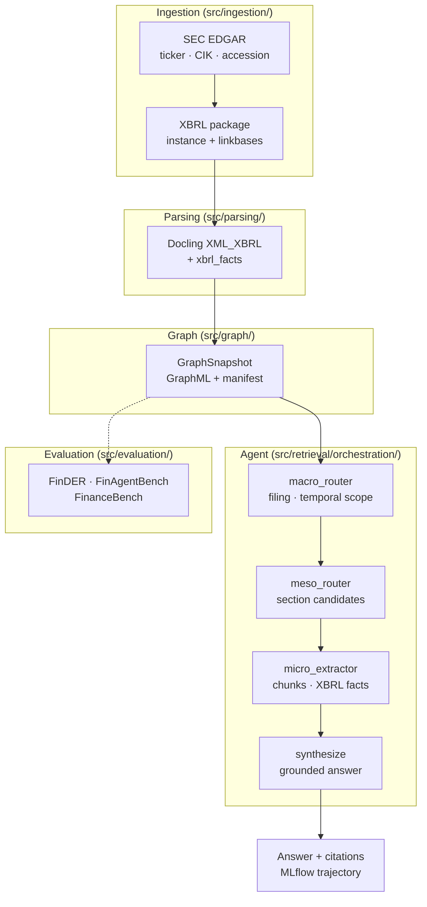
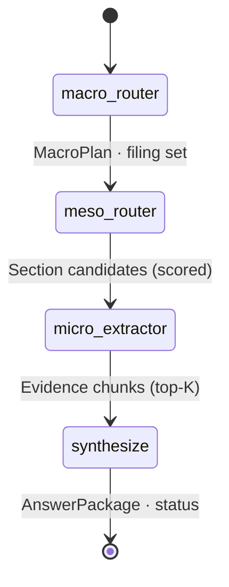

# Graph-Grounded Agentic Retrieval over XBRL Financial Disclosures

An **Agentic GraphRAG** system for answering natural-language questions over SEC regulatory filings (10-K, 10-Q). It ingests real **XBRL** packages from EDGAR, builds **hierarchical knowledge graphs** with [Docling](https://github.com/docling-project/docling) and [docling-graph](https://github.com/docling-project/docling-graph), and runs a **multi-stage LangGraph agent** that reasons over document scope, graph structure, and granular evidence before synthesizing a grounded answer.

This repository implements the research direction described in *Graph-Grounded Agentic Retrieval: Enhancing Multi-Stage Reasoning over XBRL Financial Disclosures* — transforming dense, structured financial disclosures into navigable graphs and measuring agent decision paths with MLflow trajectories and modular benchmarks.

---

## What it does

| Stage | What happens |
|-------|----------------|
| **Ingest** | Resolve ticker/CIK/accession via SEC EDGAR; download full XBRL instance + taxonomy linkbases (no third-party filing APIs). |
| **Parse** | Mandatory [Docling XBRL conversion](https://docling-project.github.io/docling/examples/xbrl_conversion/) (`InputFormat.XML_XBRL`) — sections, tables, and consolidated numeric facts. No HTML fallback. |
| **Graph** | Map `ParsedDocument` → `GraphSnapshot`: documents → sections → chunks; XBRL facts indexed as first-class paragraph chunks with human-readable excerpts. |
| **Corpus** | Materialize issuer snapshots: latest **10-K** + trailing **10-Qs** (default 4); versioned under `data/graphs/{ticker}/`. |
| **Retrieve** | CLI **temporal binding** (e.g. `prior-quarter`) → LangGraph: **macro** → **meso** → **micro** → **synthesize**, scoped to bound filing(s) and period-of-report. |
| **Observe** | MLflow runs, LangGraph trajectories, and optional Gemini judge for benchmark suites. |

Recommended workflow for multi-period questions:

```bash
# 1. Build (or refresh) the issuer corpus graph
uv run agent-query materialize --ticker AAPL

# 2. Ask with optional fiscal anchor
uv run agent-query ask --ticker AAPL --anchor prior-quarter --query "What was revenue in the prior quarter?"
```

Single-filing queries still work without an explicit `materialize` if a snapshot already exists.

---

## Architecture



**Layer boundaries** (enforced by contract tests): ingestion does not import graph/retrieval; the CLI talks to retrieval only through `QueryService`.

### Multi-stage agent

The agent is a compiled **LangGraph** `StateGraph` with four nodes:



| Node | Role | Implementation notes |
|------|------|----------------------|
| **macro_router** | Filing set for retrieval | When the CLI pre-binds filings (`--anchor`, `--period`), passes them through unchanged. Otherwise uses the LLM to pick accessions from the snapshot manifest. |
| **meso_router** | Structural navigation | Ranks **sections** only within the bound filing(s); boosts MD&A, revenue-related labels, and **XBRL Financial Facts**. |
| **micro_extractor** | Granular evidence | Extracts chunks/XBRL only from bound `doc-{accession}` nodes; boosts facts whose duration period contains the filing `period_end`. |
| **synthesize** | Grounded generation | Filters evidence to bound filings and aligned periods before LLM synthesis; template fallback if the model returns empty content. |

**Temporal scope (CLI, before the agent):** flags like `--anchor prior-quarter` resolve to concrete accessions via `src/retrieval/temporal.py` (fiscal labels inferred from the 10-K year-end month). EDGAR `reportDate` is preserved on fetch; each XBRL concept can appear with **multiple period contexts** in the graph.

### Technical stack

| Component | Technology |
|-----------|------------|
| Runtime | Python 3.12+, [uv](https://docs.astral.sh/uv/) |
| Filings | SEC EDGAR (`SEC_EDGAR_USER_AGENT`, rate-limited) |
| Parsing | Docling `docling[xbrl]>=2.94.0` (Arelle-backed) |
| Graph | NetworkX / GraphML, docling-graph mapper |
| Orchestration | LangGraph, LangChain OpenAI-compatible client |
| LLM (local) | [LM Studio](https://lmstudio.ai/) — default Qwen via OpenAI API |
| Judge (benchmarks) | Google Gemini |
| Observability | MLflow (SQLite backend recommended) |

Governed by [.specify/memory/constitution.md](.specify/memory/constitution.md). Deeper design notes: [research-xbrl-retrieval.md](specs/002-live-disclosure-cli/research-xbrl-retrieval.md).

---

## Prerequisites

- **Python 3.12+** and [uv](https://docs.astral.sh/uv/)
- **LM Studio** (or any OpenAI-compatible server) with a chat model loaded and the local server enabled — required for live `ask` when `USE_MOCK_LLM=0`
- **`SEC_EDGAR_USER_AGENT`** — your name and email per [SEC fair access](https://www.sec.gov/os/webmaster-faq#code-support)
- **`GOOGLE_API_KEY`** — for benchmark judging (`USE_MOCK_JUDGE=1` skips this in CI)

---

## Setup

```bash
git clone <repo-url> && cd agentic-graphrag-finance
uv sync --locked
cp .env.example .env
```

Edit `.env`:

| Variable | Required | Purpose |
|----------|----------|---------|
| `SEC_EDGAR_USER_AGENT` | Yes (live ingest) | `Your Name you@example.com` for EDGAR |
| `LM_STUDIO_BASE_URL` | Yes (live ask) | Default `http://localhost:1234/v1` |
| `LM_STUDIO_MODEL` | Yes (live ask) | Model id exposed by LM Studio |
| `MLFLOW_TRACKING_URI` | Recommended | `sqlite:///mlflow.db` (project default) |
| `GOOGLE_API_KEY` | Benchmarks | Gemini judge |
| `USE_MOCK_LLM` | Optional | `1` = template answers, no LM Studio |
| `USE_MOCK_JUDGE` | Optional | `1` = skip Gemini in benchmarks |
| `USE_FIXTURE_INGESTION` | Optional | `1` = bundled XBRL under `tests/fixtures/` |

> **Note:** If your shell exports `MLFLOW_TRACKING_URI=./mlruns`, the app maps that to SQLite from `configs/mlflow.yaml`. Prefer `sqlite:///mlflow.db` in `.env`. Do not use bash placeholders like `${VAR:-default}` in config files.

Start LM Studio, load your model, and enable the local server before running live queries.

---

## CLI usage

### `agent-query` — unified live pipeline

| Command | Description |
|---------|-------------|
| `ask` | Materialize multi-filing corpus (if needed) → bind temporal scope → run agent |
| `materialize` | Build versioned multi-filing graph snapshot (10-K + trailing 10-Qs) + reachability audit |
| `graph-audit` | Re-run structural reachability audit on an existing snapshot |
| `test` | Structural smoke test (fetch, parse, graph node counts; no LLM) |
| `mlflow-clean` | Reset SQLite tracking DB and remove legacy `mlruns/` dirs |

#### Materialize (multi-filing corpus)

```bash
uv run agent-query materialize --ticker AAPL
```

Builds a versioned issuer snapshot under `data/graphs/AAPL/` (`index.json` + `{snapshot_id}.graphml` + `.manifest.json`) from the latest 10-K and trailing 10-Q filings (see `configs/corpus.yaml`).

```bash
# Re-download XBRL and rebuild graphs after parser or graph-builder changes
uv run agent-query materialize --ticker AAPL --force-refresh
```

Materialize runs a **structural reachability audit** (≥100 stratified XBRL/table facts, hop budget 6, 95% pass gate) and writes `data/graphs/{issuer}/{snapshot_id}.reachability.json`. Snapshot manifests record `audit_ready` and `audit_pass_rate`. Re-run the audit alone:

```bash
uv run agent-query graph-audit --ticker AAPL --snapshot-id <uuid>
```

Config: `configs/graph_audit.yaml`, `configs/graph_similarity.yaml`. Details: [004 quickstart](specs/004-docling-graph-materialization/quickstart.md).

#### Ask

```bash
# Full snapshot (all materialized filings)
uv run agent-query ask --ticker AAPL --query "What was net sales?"

# Fiscal scope: second-latest 10-Q vs latest (issuer fiscal calendar)
uv run agent-query ask \
  --ticker AAPL \
  --anchor prior-quarter \
  --query "What was revenue in the prior quarter?"

# Other anchors: latest-annual, latest-quarter; explicit --period FY2026-Q1
uv run agent-query ask --ticker AAPL --period FY2026-Q1 --query "Revenue for that quarter?"

# Machine-readable output (includes snapshot_scope.bound_filings)
uv run agent-query ask --ticker AAPL --query "Summarize revenue drivers." --json

# Reuse a specific snapshot version
uv run agent-query ask --ticker AAPL --snapshot-id <uuid> --query "..."
```

**Identifiers** (provide at least one):

| Flag | Description |
|------|-------------|
| `--ticker` / `-t` | Resolve CIK and latest filing for form type |
| `--cik` | Direct CIK (validated against ticker if both given) |
| `--accession` / `-a` | Specific filing accession number |
| `--form` / `-f` | `10-K` (default) or `10-Q` |
| `--force-refresh` | Bypass cached XBRL under `data/raw/` |
| `--snapshot-id` | Reuse a published graph snapshot version |
| `--anchor` | Temporal scope: `latest-annual`, `prior-quarter`, `latest-quarter` |
| `--period` | Explicit fiscal label (repeatable), e.g. `FY2024-Q3` |
| `--compare` | Comma-separated fiscal periods for comparison |
| `--json` | Emit full `CLIAskResult` JSON (includes `snapshot_scope`) |

**Example output:**

```text
Revenue for the prior quarter (period ended December 27, 2025) was $124.30 billion ...

Status: SUCCESS
Snapshot: c6e2eb96-63f9-4c92-b3a0-2695fa6d6026
MLflow run: fab0ed2eef0145e4ba6c6972421d91b7
Citations: 15
Timings (ms): materialize=74, query=29941

--- Snapshot scope ---
Snapshot version: c6e2eb96-63f9-4c92-b3a0-2695fa6d6026
Bound:
  - FY2026-Q1 (10-Q) accession 0000320193-26-000006
```

#### Test (offline / CI)

```bash
USE_FIXTURE_INGESTION=1 uv run agent-query test --ticker AAPL --form 10-K
USE_FIXTURE_INGESTION=1 uv run agent-query test --ticker AAPL --check-registry --json
```

#### MLflow cleanup

```bash
uv run agent-query mlflow-clean
```

### Staged pipeline — research and debugging

Use these when you want to inspect intermediate artifacts without re-running the agent:

```bash
# 1. Ingest + parse → data/parsed/
USE_FIXTURE_INGESTION=1 uv run sec-ingest --ticker AAPL --form 10-K

# 2. Build graph → data/graphs/{issuer}/
uv run sec-graph-build --ticker AAPL

# 3. Query existing snapshot
USE_MOCK_LLM=1 uv run sec-query \
  --snapshot-id <uuid> \
  --issuer-id AAPL \
  --question "What are total assets?"

# 4. Benchmark retrieval paths (pilot suite)
USE_MOCK_LLM=1 USE_MOCK_JUDGE=1 uv run sec-benchmark \
  --snapshot-id <uuid> \
  --issuer-id AAPL \
  --max-items 5
```

| Script | Module | Purpose |
|--------|--------|---------|
| `sec-ingest` | `parsing.cli` | Fetch/parse XBRL to `ParsedDocument` JSON |
| `sec-graph-build` | `graph.cli` | Build `GraphSnapshot` from parsed docs |
| `sec-query` | `retrieval.cli` | Run LangGraph agent on a snapshot |
| `sec-benchmark` | `evaluation.cli` | FinDER / FinAgentBench / FinanceBench pilot |

### MLflow UI

```bash
uv run mlflow ui --backend-store-uri sqlite:///mlflow.db
```

Open the printed URL to inspect runs, tags (`ticker`, `accession`, `cik`), and exported agent trajectories.

---

## Data layout

| Path | Contents |
|------|----------|
| `data/raw/sec_downloads/{ticker}/{accession}/` | EDGAR XBRL package + `manifest.json` |
| `data/cache/edgar/` | Cached `company_tickers.json` |
| `data/parsed/{ticker}/{accession}.json` | `ParsedDocument` JSON per filing |
| `data/graphs/{issuer}/` | `{snapshot_id}.graphml` + `.manifest.json` + `index.json` (multi-filing registry) |
| `data/benchmarks/` | Benchmark JSONL inputs |
| `tests/fixtures/sec_downloads/` | Offline XBRL for CI (`USE_FIXTURE_INGESTION=1`) |
| `mlflow.db` | SQLite tracking store (gitignored) |

---

## Testing

```bash
uv run ruff check src tests

USE_FIXTURE_INGESTION=1 USE_MOCK_LLM=1 USE_MOCK_JUDGE=1 \
  SEC_EDGAR_USER_AGENT="Test test@example.com" \
  uv run pytest -q
```

Contract tests verify import boundaries between layers. Integration tests may require LM Studio or mocks.

---

## Project layout

```text
src/
  ingestion/     EDGAR client, corpus materialize, XBRL downloader
  parsing/       Docling XBRL pipeline, multi-context XBRL facts
  graph/         Snapshot builder, issuer registry, GraphML store
  retrieval/     Temporal binding, evidence_scope, LangGraph, synthesis
  evaluation/    Benchmark registry and Gemini judge
  tracing/       MLflow setup, trajectories, cleanup
  cli/           agent-query (ask · test · mlflow-clean)
  models/        Pydantic domain types and enums
  contracts/     Service interfaces
```

---

## Specifications

| Document | Scope |
|----------|-------|
| [001 plan](specs/001-sec-disclosure-rag/plan.md) | Core GraphRAG pipeline and benchmarks |
| [002 quickstart](specs/002-live-disclosure-cli/quickstart.md) | Live EDGAR ingestion and CLI contracts |
| [003 quickstart](specs/003-multi-filing-corpus/quickstart.md) | Multi-filing corpus, materialize, temporal `ask` |
| [XBRL research](specs/002-live-disclosure-cli/research-xbrl-retrieval.md) | XBRL-first retrieval design |
