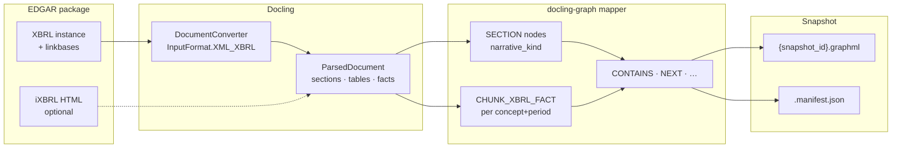
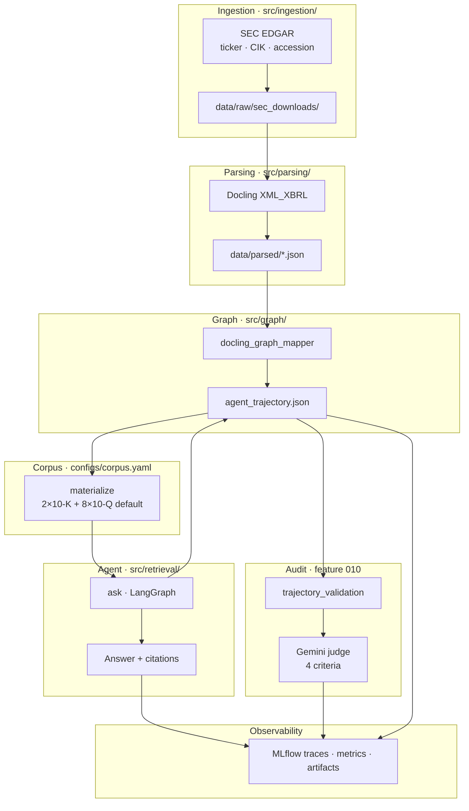
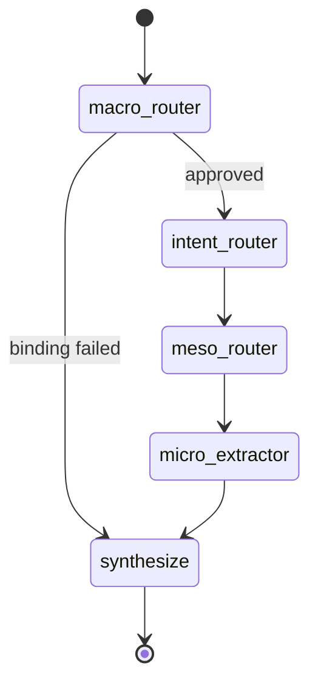
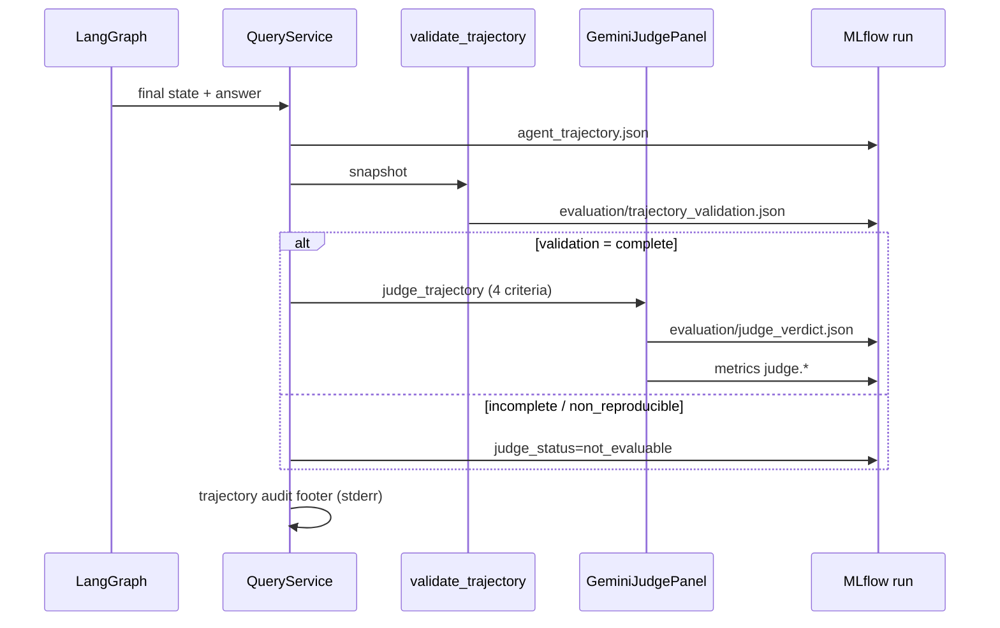

# Graph-Grounded Agentic Retrieval over XBRL Financial Disclosures

An **Agentic GraphRAG** system for answering natural-language questions over SEC **10-K** and **10-Q** filings. It downloads real **XBRL** packages from EDGAR, turns them into structured documents with **[Docling](https://github.com/docling-project/docling)**, materializes issuer-level **knowledge graphs** aligned with the **[docling-graph](https://github.com/docling-project/docling-graph)** entity–relationship model, and runs a **LangGraph** agent that binds filings, navigates the graph, extracts evidence, and synthesizes a grounded answer—with full trajectories in **MLflow**.

This repository implements the research direction in *Graph-Grounded Agentic Retrieval: Enhancing Multi-Stage Reasoning over XBRL Financial Disclosures*.

**New to XBRL or Docling?** Read the step-by-step guide: **[End-to-end walkthrough](docs/end-to-end-walkthrough.md)** (materialize → ask → trajectory → judge, with concrete Apple examples).

---

## Quick start

**Prerequisites:** Python 3.12+, [uv](https://docs.astral.sh/uv/), [LM Studio](https://lmstudio.ai/) with a loaded chat model (context length ≈ `16384` per `configs/lm_studio.yaml`), and `SEC_EDGAR_USER_AGENT` in `.env`.

```bash
uv sync --locked && cp .env.example .env   # edit .env, then start LM Studio server

# Build issuer graph (Docling parse → docling-graph snapshot; ~minutes first run)
uv run agent-query materialize --ticker AAPL

# Ask with live LLM (answer on stdout, trace on stderr)
USE_MOCK_LLM=0 uv run agent-query ask --ticker AAPL --trace normal \
  --query "How did total net sales change year over year?"
```

| Goal | Command |
|------|---------|
| YoY / multi-period (autonomous filing pick) | `ask` with no `--anchor` |
| Specific quarter | `ask --anchor prior-quarter --query "…"` |
| Latest 10-K narrative | `ask --anchor latest-annual --query "…"` |
| Offline / CI (no LM Studio) | `USE_MOCK_LLM=1 USE_MOCK_JUDGE=1 uv run agent-query test --ticker AAPL` |

Details: [setup](#prerequisites-and-setup) · [all CLI flags](#cli-reference-agent-query) · [end-to-end walkthrough](docs/end-to-end-walkthrough.md) · [more examples](#live-usage-examples)

---

## Table of contents

- [Quick start](#quick-start)
- [End-to-end walkthrough](docs/end-to-end-walkthrough.md)
- [How the agent works](#how-the-agent-works)
- [Docling and docling-graph](#docling-and-docling-graph)
- [Architecture](#architecture)
- [Prerequisites and setup](#prerequisites-and-setup)
- [CLI reference (`agent-query`)](#cli-reference-agent-query)
- [Live usage examples](#live-usage-examples)
- [Staged pipeline (debugging)](#staged-pipeline-debugging)
- [Data layout](#data-layout)
- [Trajectory audit and judge](#trajectory-audit-and-judge)
- [Testing](#testing)
- [Specifications](#specifications)

---

## How the agent works

At a high level, every **`ask`** run does the following:

1. **Corpus** — Ensure an issuer **graph snapshot** exists (multi-filing: trailing **two fiscal years** of 10-K and 10-Q by default). If not, fetch/parse/materialize automatically or via **`materialize`**.
2. **Macro** — Decide *which filings* answer the question (e.g. latest annual + prior annual for YoY, or latest quarter). The LLM proposes accessions; a **deterministic validator** approves or fails closed.
3. **Intent** — Classify the question as **numeric** (XBRL-first), **qualitative** (HTML narrative-first), or **hybrid**.
4. **Meso** — Within each bound filing, pick **sections** to search (default: **TOC planner** — one LLM call per filing over a table of contents with `narrative_kind` tags).
5. **Micro** — Collect **evidence chunks** under those sections (XBRL fact nodes, table rows, HTML paragraphs), score and rank them, apply source bias.
6. **Synthesize** — Send top evidence to the **local LLM** (LM Studio) with strict grounding instructions; produce prose + citations.
7. **Audit** — Export a versioned **agent trajectory**, run a deterministic **validator**, then a blocking **Gemini judge** (four rubric scores). Results land in MLflow metrics/artifacts and a stderr **trajectory audit** footer when tracing is enabled.

Nothing answers from model memory alone: the agent only sees evidence extracted from the graph for the **bound** accessions and periods. The judge scores whether that path was auditable—not whether the model “guessed” from training data.

---

## Docling and docling-graph

These two libraries split **parsing** from **graph materialization**. Both are required; neither is optional for the live pipeline.

| Resource | Link |
|----------|------|
| Docling XBRL tutorial | [XBRL Document Conversion](https://docling-project.github.io/docling/examples/xbrl_conversion/) |
| Docling source | [github.com/docling-project/docling](https://github.com/docling-project/docling) |
| docling-graph | [github.com/docling-project/docling-graph](https://github.com/docling-project/docling-graph) |
| **End-to-end tour (this repo)** | [docs/end-to-end-walkthrough.md](docs/end-to-end-walkthrough.md) — includes best practices for both libraries |

### Docling — XBRL parsing (`src/parsing/`)

**Role:** Convert each cached EDGAR XBRL **instance document** into a `ParsedDocument` (sections, tables, footnotes, consolidated facts).

| Aspect | Detail |
|--------|--------|
| **Input** | XBRL instance XML (e.g. `*_htm.xml`) plus taxonomy linkbases in the filing package |
| **API** | `DocumentConverter` with `InputFormat.XML_XBRL` (Arelle-backed; requires `docling[xbrl]`; see [official XBRL example](https://docling-project.github.io/docling/examples/xbrl_conversion/)) |
| **Output** | `ParsedDocument` JSON under `data/parsed/{ticker}/{accession}.json` |
| **XBRL facts** | Docling emits key–value fact rows; `xbrl_facts.py` consolidates them into one record per **concept + period** |
| **HTML supplement** | Optional inline iXBRL HTML (MD&A, risk factors) merged at materialize; see `configs/html_narrative.yaml` |

Docling preserves **structure** (sections, reading order, tables) that flat text extraction would lose. Numeric questions depend on facts like `RevenueFromContractWithCustomerExcludingAssessedTax` with explicit **period** and **decimals** metadata.

Config: `configs/docling_xbrl.yaml` · Implementation: `src/parsing/docling_xbrl.py` · Design: [research-xbrl-retrieval.md](specs/002-live-disclosure-cli/research-xbrl-retrieval.md) · Walkthrough: [end-to-end guide](docs/end-to-end-walkthrough.md#what-docling-does-here)

### docling-graph — Knowledge graph materialization (`src/graph/`)

**Role:** Turn each `ParsedDocument` into typed **nodes** and **edges** in a `GraphSnapshot` stored as GraphML + manifest.

| Aspect | Detail |
|--------|--------|
| **Mapper** | `docling_graph_mapper.map_filing()` — implements the docling-graph **ER schema contract** (document → section → chunk; XBRL facts as first-class nodes) |
| **Node types** | `DOCUMENT`, `SECTION`, `CHUNK_TABLE`, `CHUNK_ROW`, `CHUNK_PARAGRAPH`, `CHUNK_XBRL_FACT` |
| **Structural edges** | `CONTAINS`, `NEXT`, `FOOTNOTE_OF`, `REFERENCES` (agent navigation + reachability audit) |
| **Cross-filing edges** | `TEMPORAL_TRANSITION` between documents; optional `SEMANTIC_SIMILARITY` for same concept across periods |
| **XBRL in graph** | Every consolidated fact instance → `CHUNK_XBRL_FACT` with readable excerpt (`XBRL {concept}: $… for period …`) |
| **Section ontology** | `narrative_kind` / `item_number` on SECTION nodes (e.g. `md_and_a`, `risk_factors`, `xbrl_bucket`) for TOC planner |
| **Fail-closed** | Filings with zero structure are excluded from the snapshot with a recorded reason |

The [docling-graph](https://github.com/docling-project/docling-graph) package defines the target schema (explicit entities and edges for high-precision domains like finance). This repo’s mapper bridges **Docling parse output** into internal `GraphNode` / `GraphEdge` models (see `DOCLING_GRAPH_MAPPER_VERSION` in `src/graph/docling_graph_mapper.py`) rather than using the upstream LLM `run_pipeline` on every filing—XBRL is already structured. Default builder: `src/graph/builder.py` (`GRAPH_BUILDER=docling-graph`; `legacy` escape hatch only).

After materialize, a **reachability audit** samples XBRL/table facts and verifies ≥95% are reachable from the document root in ≤6 structural hops (`graph-audit`, `configs/graph_audit.yaml`).

Design: [004 spec](specs/004-docling-graph-materialization/spec.md) · Edge catalog: [contracts/edge-catalog.md](specs/004-docling-graph-materialization/contracts/edge-catalog.md) · Walkthrough: [end-to-end guide](docs/end-to-end-walkthrough.md#what-docling-graph-means-in-this-repo)

### Parse → graph flow



---

## Architecture

### End-to-end pipeline



**Layer boundaries** (contract tests): `ingestion` does not import `graph` or `retrieval`; the CLI calls retrieval only through `QueryService`.

### LangGraph agent (current)



After the graph completes, **QueryService** (outside LangGraph) exports the trajectory, validates it, and runs the Gemini judge—see [Trajectory audit and judge](#trajectory-audit-and-judge).

| Stage | Node | What it decides | LLM? |
|-------|------|-----------------|------|
| **Macro** | `macro_router` | Which filing accessions (10-K / 10-Q) and comparison mode (YoY, QoQ, single anchor) | Yes (unless CLI pre-binds via `--anchor` / `--period`) |
| **Intent** | `intent_router` | `numeric` → XBRL-primary scoring; `qualitative` → HTML-primary | Yes (+ keyword fallback) |
| **Meso** | `meso_router` | Top sections per filing (`xbrl_bucket`, `md_and_a`, `risk_factors`, …) | Yes — **TOC planner** (default) or `graph_walk` |
| **Micro** | `micro_extractor` | Evidence chunks in section subtrees; concept-aware XBRL narrowing | Heuristic scoring (+ structural scope) |
| **Synthesize** | `synthesize` | Grounded natural-language answer | Yes (template / deterministic YoY fallback if empty) |

**Meso default (`configs/graph_navigation.yaml`):** `meso.discovery_mode: toc_planner` — LLM reads a compact TOC (Item 1 / 1A / 7 / XBRL bucket) and returns ranked `section_node_id`s. **Micro** walks only `CONTAINS` descendants of those sections.

**Temporal binding (CLI):** Flags like `--anchor prior-quarter` resolve to concrete accessions *before* the agent via `src/retrieval/temporal.py` (fiscal labels use the issuer’s 10-K year-end month). Autonomous macro (no flags) lets the LLM propose filings; the validator enforces corpus rules.

### Technical stack

| Component | Technology |
|-----------|------------|
| Runtime | Python 3.12+, [uv](https://docs.astral.sh/uv/) |
| Filings | SEC EDGAR (`SEC_EDGAR_USER_AGENT`, rate-limited) |
| Parsing | Docling `docling[xbrl]>=2.94.0` |
| Graph | docling-graph schema + `docling_graph_mapper`, NetworkX / GraphML |
| Orchestration | LangGraph, LangChain OpenAI-compatible client |
| LLM (local) | [LM Studio](https://lmstudio.ai/) — default Qwen via OpenAI API |
| Judge (every `ask`) | Google Gemini 2.5 Pro (`GOOGLE_API_KEY`; `USE_MOCK_JUDGE=1` in CI) |
| Observability | MLflow (SQLite recommended), Rich console trace |

Governed by [.specify/memory/constitution.md](.specify/memory/constitution.md).

---

## Prerequisites and setup

- **Python 3.12+** and [uv](https://docs.astral.sh/uv/)
- **LM Studio** with a chat model loaded, local server enabled, **context length** matching `configs/lm_studio.yaml` (e.g. `16384`)
- **`SEC_EDGAR_USER_AGENT`** — `Your Name you@example.com` per [SEC fair access](https://www.sec.gov/os/webmaster-faq#code-support)
- **`GOOGLE_API_KEY`** — only for benchmark judging (`USE_MOCK_JUDGE=1` in CI)

```bash
git clone <repo-url> && cd agentic-graphrag-finance
uv sync --locked
cp .env.example .env
```

| Variable | Required | Purpose |
|----------|----------|---------|
| `SEC_EDGAR_USER_AGENT` | Live ingest | EDGAR identity string |
| `LM_STUDIO_BASE_URL` | Live `ask` | Default `http://localhost:1234/v1` |
| `LM_STUDIO_MODEL` | Live `ask` | Model id from LM Studio |
| `MLFLOW_TRACKING_URI` | Recommended | `sqlite:///mlflow.db` |
| `GOOGLE_API_KEY` | Live `ask` audit | Gemini trajectory judge (`USE_MOCK_JUDGE=0`) |
| `USE_MOCK_LLM` | Optional | `1` = no LM Studio; template / deterministic answers |
| `USE_MOCK_JUDGE` | Optional | `1` = mock judge (CI); `0` = live Gemini judge on every `ask` |
| `USE_FIXTURE_INGESTION` | Optional | `1` = bundled XBRL under `tests/fixtures/` |

Set `context_tokens` in `configs/lm_studio.yaml` to match LM Studio after **reloading** the model. If you see `n_ctx: 4096` errors while config says `16384`, reload the model or set `LLM_CONTEXT_TOKENS=4096` until you do.

---

## CLI reference (`agent-query`)

All commands: `uv run agent-query <command> [options]`

| Command | Purpose |
|---------|---------|
| **`materialize`** | Fetch (if needed), Docling-parse, build multi-filing graph snapshot + reachability audit |
| **`ask`** | Resolve snapshot → temporal/macro binding → run LangGraph agent → print answer |
| **`graph-audit`** | Re-run structural reachability audit on an existing snapshot |
| **`test`** | Offline structural checks, macro-binding eval, or gold-path navigation eval |
| **`mlflow-clean`** | Reset SQLite tracking DB and remove legacy `mlruns/` dirs |

### `materialize`

Builds a versioned issuer snapshot under `data/graphs/{TICKER}/`:

- `index.json` — latest `snapshot_id`
- `{snapshot_id}.graphml` — full graph
- `{snapshot_id}.manifest.json` — filing list, audit metadata
- `{snapshot_id}.reachability.json` — audit report

**Default corpus** (`configs/corpus.yaml`): **2× 10-K** + **8× 10-Q** (~two fiscal years), max 12 filings.

```bash
uv run agent-query materialize --ticker AAPL

# Re-download XBRL and rebuild after parser/graph changes
uv run agent-query materialize --ticker AAPL --force-refresh

# XBRL-only (skip HTML MD&A / risk narrative supplement)
uv run agent-query materialize --ticker AAPL --skip-html-narrative

# Cap corpus size
uv run agent-query materialize --ticker AAPL --max-filings 6
```

| Flag | Description |
|------|-------------|
| `--ticker` / `-t` | Issuer ticker |
| `--cik` | CIK (alternative to ticker) |
| `--force-refresh` | Re-fetch filings even if cached |
| `--skip-html-narrative` | Skip HTML narrative merge at parse |
| `--max-filings` | Override corpus cap (default 12) |
| `--json` | Machine-readable job summary |

**Re-materialize** after upgrading graph code so SECTION nodes include `narrative_kind` / `item_number` (needed for TOC planner).

### `ask`

Runs the full agent. Uses latest snapshot for the issuer unless `--snapshot-id` is set.

```bash
# Requires LM Studio (or set USE_MOCK_LLM=1 for offline template mode)
USE_MOCK_LLM=0 uv run agent-query ask --ticker AAPL --query "Your question"
```

| Flag | Description |
|------|-------------|
| `--query` / `-q` | **Required.** Natural-language question |
| `--ticker` / `-t` | Issuer ticker |
| `--cik` | CIK |
| `--accession` / `-a` | Single-filing mode (no multi-filing corpus flags) |
| `--form` / `-f` | `10-K` (default) or `10-Q` when using `--accession` |
| `--force-refresh` | Refresh cached XBRL before ask |
| `--snapshot-id` | Pin a specific graph version |
| `--anchor` | Pre-bind: `latest-annual`, `prior-quarter`, `latest-quarter` |
| `--period` | Explicit fiscal label(s), e.g. `FY2025`, `FY2024-Q3` (repeatable) |
| `--compare` | Comma-separated periods for comparison binding |
| `--trace` | `quiet` \| `normal` \| `verbose` — stage panels on **stderr** |
| `--trace-json` | JSONL trace events on stderr |
| `--json` | Full `CLIAskResult` JSON on **stdout** |

`AGENT_QUERY_TRACE=normal|verbose|quiet` overrides non-TTY defaults. Answer text goes to **stdout**; trace to **stderr**.

**Trace levels**

- **`normal`** — Per-stage summary, macro binding, meso section ranks, micro top chunks with scores
- **`verbose`** — Above plus LLM prompt/response previews, structural paths (`CONTAINS → …`)

Configs: `configs/trace.yaml`, `configs/lm_studio.yaml`, `configs/graph_navigation.yaml`, `configs/intent_router.yaml`

### `graph-audit`

```bash
uv run agent-query graph-audit --ticker AAPL --snapshot-id <uuid>
```

Recomputes reachability from document roots to stratified XBRL/table facts. Gate: 95% within 6 hops (`configs/graph_audit.yaml`).

### `test`

**Structural smoke** (no LLM) — fetch/parse/graph counts:

```bash
USE_FIXTURE_INGESTION=1 uv run agent-query test --ticker AAPL --form 10-K
```

**Macro binding benchmark** (mock LLM fixtures):

```bash
USE_MOCK_LLM=1 uv run agent-query test --macro-binding --ticker AAPL
```

**Gold-path navigation** (mock LLM; needs materialized AAPL graph):

```bash
USE_MOCK_LLM=1 uv run agent-query test --gold-path
```

| Flag | Description |
|------|-------------|
| `--macro-binding` | 008 accession-set accuracy slice |
| `--gold-path` | 009 navigation reachability on `tests/fixtures/gold_path/` |
| `--check-registry` | Validate snapshot registry |
| `--min-sections` | Structural threshold |
| `--json` | JSON report |

### `mlflow-clean`

```bash
uv run agent-query mlflow-clean
```

### MLflow UI

```bash
uv run mlflow ui --backend-store-uri sqlite:///mlflow.db
```

Inspect runs, **Traces** (LangGraph spans), **Metrics** (`judge.trajectory_coherence`, etc.), `evaluation/judge_verdict.json`, `evaluation/trajectory_validation.json`, `agent_trajectory.json`, plus legacy `trajectory.json`, `macro_binding.json`, `navigation_trace.json`, `intent_router.json`.

Every production `ask` runs a **blocking trajectory validator** and **Gemini judge** (`GOOGLE_API_KEY`, `USE_MOCK_JUDGE=0`) before the CLI finishes; stderr shows a compact audit footer when `--trace normal` or `verbose`.

---

## Trajectory audit and judge

After LangGraph returns, `QueryService` builds an `AgentTrajectorySnapshot` (plan, document route with `filed_at`, graph hops, evidence) and runs `run_post_query_audit()`:



| Criterion | What it measures |
|-----------|------------------|
| `trajectory_coherence` | Plan → route → hops → evidence tell one story (uses `evaluation_as_of` + `filed_at`; not “future FY” skepticism) |
| `routing_decisions` | Filing binding, intent, section choices |
| `retrieval_fidelity` | Evidence matches bound accessions and question |
| `synthesis_grounding` | Answer stays within cited evidence |

**Validator outcomes:** `complete` → judge runs; `incomplete` / `non_reproducible` → judge skipped (`not_evaluable`). Config: `configs/trajectory_judge.yaml`, `configs/judges/gemini_2_5_pro.yaml`.

**Console footer** (`--trace normal` / `verbose`):

```text
validation: complete
judge: ok (gemini-2.5-pro)
  trajectory_coherence: 0.92
  routing_decisions: 1.00
  ...
weakest: synthesis_grounding @ synthesis
```

Design: [010 spec](specs/010-mlflow-trajectory-judge-eval/spec.md) · [010 plan](specs/010-mlflow-trajectory-judge-eval/plan.md) · [ask-pipeline-judge contract](specs/010-mlflow-trajectory-judge-eval/contracts/ask-pipeline-judge.md)

---

## Live usage examples

These examples assume **LM Studio is running**, `USE_MOCK_LLM` is **unset or `0`**, and you have run **`materialize`** for AAPL at least once.

### 1. Year-over-year net sales (multi-filing, autonomous macro)

The macro router selects two annual 10-Ks; meso targets **XBRL Financial Facts**; micro pulls `RevenueFromContractWithCustomer…` facts; synthesis compares FY totals.

```bash
uv run agent-query materialize --ticker AAPL

USE_MOCK_LLM=0 uv run agent-query ask --ticker AAPL --trace verbose \
  --query "How did total net sales change year over year?"
```

Expect: macro **YoY** with two accessions; meso `toc_planner (xbrl_bucket)`; answer with dollar amounts and % change grounded in XBRL citations; audit footer with four judge scores and MLflow metrics `judge.*`.

### 2. Prior-quarter revenue (CLI anchor + numeric intent)

```bash
USE_MOCK_LLM=0 uv run agent-query ask --ticker AAPL --trace normal \
  --anchor prior-quarter \
  --query "What was revenue in the prior quarter?"
```

Macro uses your anchor instead of autonomous proposal; intent router biases toward **XBRL** facts aligned to that quarter’s `period_end`.

### 3. MD&A and risk factors (qualitative, HTML-primary)

Requires HTML narrative in the snapshot (default materialize includes it).

```bash
USE_MOCK_LLM=0 uv run agent-query ask --ticker AAPL --trace verbose \
  --query "What are the principal risk factors discussed in management's discussion and analysis?"
```

Expect: intent **qualitative**; meso selects `md_and_a` / related sections (TOC planner excludes irrelevant kinds); micro favors **HTML** chunks; synthesis summarizes narrative, not raw taxonomy lines.

### 4. Latest annual risk factors (Item 1A)

```bash
USE_MOCK_LLM=0 uv run agent-query ask --ticker AAPL --trace normal \
  --anchor latest-annual \
  --query "Summarize the principal risk factors in the latest annual report."
```

### 5. Explicit fiscal period

```bash
USE_MOCK_LLM=0 uv run agent-query ask --ticker AAPL \
  --period FY2025-Q1 \
  --query "What did the filing report for that quarter?"
```

### 6. Machine-readable output

```bash
USE_MOCK_LLM=0 uv run agent-query ask --ticker AAPL --json --trace quiet 2>/dev/null \
  --query "What was total net sales?" | jq '{status, text: .answer.text, bound: .snapshot_scope.bound_filings}'
```

### Example terminal output (abbreviated)

```text
Total net sales increased year over year, from $391.04 billion in FY2024
to $416.16 billion in FY2025 (+$25.12 billion, +6.4%), per
RevenueFromContractWithCustomerExcludingAssessedTax in the bound 10-K filings.

Status: SUCCESS
Snapshot: e84614ad-5d73-4243-9eb7-d1b237714e0d
MLflow run: …
Citations: 8

--- Snapshot scope ---
Bound:
  - FY2025 (10-K) accession 0000320193-25-000079
  - FY2024 (10-K) accession 0000320193-24-000123
```

---

## Staged pipeline (debugging)

Inspect layers without running the full agent:

```bash
# 1. Ingest + Docling parse → data/parsed/
USE_FIXTURE_INGESTION=1 uv run sec-ingest --ticker AAPL --form 10-K

# 2. docling-graph mapper → data/graphs/{issuer}/
uv run sec-graph-build --ticker AAPL

# 3. LangGraph query on a snapshot
USE_MOCK_LLM=0 uv run sec-query \
  --snapshot-id <uuid> \
  --issuer-id AAPL \
  --question "What are total assets?"

# 4. Benchmark pilot (optional)
USE_MOCK_LLM=1 USE_MOCK_JUDGE=1 uv run sec-benchmark \
  --snapshot-id <uuid> --issuer-id AAPL --max-items 5
```

| Script | Module | Purpose |
|--------|--------|---------|
| `sec-ingest` | `parsing.cli` | Fetch/parse → `ParsedDocument` JSON |
| `sec-graph-build` | `graph.cli` | `ParsedDocument` → `GraphSnapshot` |
| `sec-query` | `retrieval.cli` | LangGraph on one snapshot |
| `sec-benchmark` | `evaluation.cli` | FinDER / FinAgentBench / FinanceBench pilot |
| `agent-query benchmark-dataset` | `cli.commands.benchmark_dataset` | Generate/publish **custom-judge** evaluation dataset (011) |
| `agent-query repro` | `cli.commands.repro` | Reproduce paper benchmark tables on custom-judge (012) |

### Research reproduction (012)

Reproduce **Graph-Grounded Agentic Retrieval** paper tables on the **custom-judge** dataset. The pipeline has two phases: **(1)** build a frozen corpus from **live SEC EDGAR** (`benchmark-dataset generate`), then **(2)** run five variants on that bundle (`repro run-all`). Phase 2 uses **Gemini** (judge, all variants), **LM Studio / Qwen** (agent for graph-full and ablations), and **MiniLM** (embeddings for the flat-chunk dense-RAG baseline only). Eval uses `OFFLINE_BENCHMARK=1` (no EDGAR during scoring — intentional for fair comparison).

**Full walkthrough:** [docs/research-reproduction.md](docs/research-reproduction.md)

**Live end-to-end smoke (2 items, ~5–15 min):**

```bash
# Phase 1 — live EDGAR + Gemini item generation
uv run agent-query benchmark-dataset generate \
  -c configs/benchmarks/custom_judge_live.yaml \
  --run-id live-repro-smoke --target-items 2 --trace verbose

# Phase 2 — live judge + LLM, five variants, table export
export OFFLINE_BENCHMARK=1 USE_MOCK_JUDGE=0 USE_MOCK_LLM=0
uv run agent-query repro run-all \
  --manifest releases/paper-live-smoke/manifest.yaml \
  --output reports/repro-live-smoke --max-items 2
```

Requires `.env`: `SEC_EDGAR_USER_AGENT`, `GOOGLE_API_KEY`, LM Studio running (graph variants). Also `uv sync --extra reproduction` for MiniLM (flat-chunk). CI fixture smoke (mock judge/LLM): see doc § CI smoke.

### Custom-judge evaluation dataset (011)

The project can **generate its own evaluation benchmark** (`custom-judge`) from live SEC filings instead of relying solely on external JSONL sets. A batch pipeline:

1. **Samples** issuers/filings from a committed allowlist (seed-reproducible).
2. **Materializes** XBRL + docling-graph snapshots via the same path as production `ask`.
3. **Authors** Q&A items with **Gemini**, styled after FinanceBench / FinDER / FinAgentBench taxonomies.
4. **Validates** items against the bundled graph (section paths, accessions, profile rules).
5. **Bundles** a versioned draft for operator review → **`publish`** → registry plug-in for offline eval.

**Detailed guide:** [docs/custom-judge-dataset-generation.md](docs/custom-judge-dataset-generation.md) (flow, configs, outputs, quality review checklist).

**Operator quickstart:** [specs/011-judge-eval-dataset/quickstart.md](specs/011-judge-eval-dataset/quickstart.md)

```bash
# Live EDGAR + Gemini smoke (default local test)
uv run agent-query benchmark-dataset generate \
  -c configs/benchmarks/custom_judge_live.yaml \
  --run-id live-edgar-smoke --target-items 2 --trace verbose
```

Requires `.env`: `SEC_EDGAR_USER_AGENT`, `GOOGLE_API_KEY`. Draft output: `data/benchmarks/custom-judge/drafts/{run_id}/` — start review with `items/dev.jsonl` and `generation_report.json` (see doc above).

```bash
# CI only: fixture EDGAR + mock judge
USE_FIXTURE_INGESTION=1 USE_MOCK_JUDGE=1 uv run agent-query benchmark-dataset generate \
  -c configs/benchmarks/custom_judge_ci.yaml --mock-judge --trace verbose
```

---

## Data layout

| Path | Contents |
|------|----------|
| `data/raw/sec_downloads/{ticker}/{accession}/` | EDGAR XBRL package + `manifest.json` |
| `data/cache/edgar/` | Cached `company_tickers.json` |
| `data/parsed/{ticker}/{accession}.json` | Docling `ParsedDocument` |
| `data/graphs/{issuer}/` | GraphML, manifests, `index.json`, reachability reports |
| `data/benchmarks/` | Benchmark JSONL; **custom-judge** drafts under `custom-judge/drafts/{run_id}/`, published under `custom-judge/v{version}/` |
| `data/benchmarks/custom-judge/drafts/{run_id}/` | Draft bundle: `items/dev.jsonl`, `generation_report.json`, `corpus/`, manifests (see [custom-judge doc](docs/custom-judge-dataset-generation.md)) |
| `tests/fixtures/sec_downloads/` | Offline XBRL for CI |
| `mlflow.db` | SQLite tracking (gitignored) |

---

## Testing

```bash
uv run ruff check src tests

USE_FIXTURE_INGESTION=1 USE_MOCK_LLM=1 USE_MOCK_JUDGE=1 \
  SEC_EDGAR_USER_AGENT="Test test@example.com" \
  uv run pytest -q
```

Contract tests enforce layer import boundaries. Navigation gold-path and macro-binding suites live under `tests/` and `agent-query test`.

Manual checklist: [docs/navigation-trace-usability-checklist.md](docs/navigation-trace-usability-checklist.md) · Full pipeline tour: [docs/end-to-end-walkthrough.md](docs/end-to-end-walkthrough.md)

---

## Project layout

```text
src/
  ingestion/     EDGAR client, corpus materialize, XBRL downloader
  parsing/       Docling XBRL pipeline, xbrl_facts, HTML narrative
  graph/         docling_graph_mapper, builder, registry, reachability audit
  retrieval/     LangGraph agent, navigation (TOC planner, walker), synthesis
  evaluation/    Benchmarks, validator, ask_judge, gate, Gemini panel
  tracing/       MLflow, console trace, trajectories
  cli/           agent-query commands
  models/        Pydantic types
  contracts/     Service interfaces
configs/         corpus, docling_xbrl, graph_navigation, lm_studio, trace, …
```

---

## Specifications

Feature work is tracked under `specs/{NNN-feature-name}/`. Each folder has a **spec** (requirements), **plan** (architecture and phases), and often **tasks**, **contracts**, and **research** notes.

| ID | Feature | Spec | Plan |
|----|---------|------|------|
| — | Project constitution (principles, audit hooks) | [constitution](.specify/memory/constitution.md) | — |
| 001 | Core GraphRAG pipeline and benchmarks | [spec](specs/001-sec-disclosure-rag/spec.md) | [plan](specs/001-sec-disclosure-rag/plan.md) |
| 002 | Live EDGAR ingestion and CLI | [spec](specs/002-live-disclosure-cli/spec.md) | [plan](specs/002-live-disclosure-cli/plan.md) |
| 003 | Multi-filing corpus and temporal `ask` | [spec](specs/003-multi-filing-corpus/spec.md) | [plan](specs/003-multi-filing-corpus/plan.md) |
| 004 | docling-graph materialization and reachability audit | [spec](specs/004-docling-graph-materialization/spec.md) | [plan](specs/004-docling-graph-materialization/plan.md) |
| 005 | HTML narrative supplement (MD&A, risk factors) | [spec](specs/005-html-narrative-supplement/spec.md) | [plan](specs/005-html-narrative-supplement/plan.md) |
| 007 | Console trace (`--trace`, Rich panels) | [spec](specs/007-ask-console-trace/spec.md) | [plan](specs/007-ask-console-trace/plan.md) |
| 008 | Autonomous macro binding and validator | [spec](specs/008-autonomous-macro-routing/spec.md) | [plan](specs/008-autonomous-macro-routing/plan.md) |
| 009 | Graph-native meso/micro navigation | [spec](specs/009-graph-native-meso-micro/spec.md) | [plan](specs/009-graph-native-meso-micro/plan.md) |
| **010** | **MLflow trajectories, validator, blocking judge** | [spec](specs/010-mlflow-trajectory-judge-eval/spec.md) | [plan](specs/010-mlflow-trajectory-judge-eval/plan.md) |
| **011** | **Judge-generated custom evaluation dataset (`custom-judge`)** | [spec](specs/011-judge-eval-dataset/spec.md) | [plan](specs/011-judge-eval-dataset/plan.md) |

**Active implementation plan** (agent routing in Cursor): [002 plan](specs/002-live-disclosure-cli/plan.md) with extensions from 003–012.

**Design notes (not feature specs):**

- [Custom-judge dataset generation](docs/custom-judge-dataset-generation.md)
- [XBRL-first retrieval research](specs/002-live-disclosure-cli/research-xbrl-retrieval.md)
- [docling-graph edge catalog](specs/004-docling-graph-materialization/contracts/edge-catalog.md)
- [Trajectory judge pipeline contract](specs/010-mlflow-trajectory-judge-eval/contracts/ask-pipeline-judge.md)
