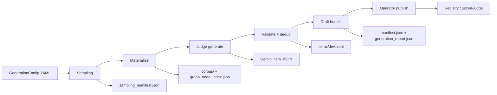

# Custom-Judge Evaluation Dataset Generation

This guide describes how the project builds a **versioned, offline evaluation benchmark** from live SEC EDGAR filings. The pipeline samples issuers, materializes XBRL/graph snapshots through the same production path as `agent-query ask`, uses **Gemini** to author grounded Q&A items, validates them against the bundled graph index, and writes a reproducible draft bundle.

Question **style and taxonomy** are inspired by three public financial QA benchmarks (FinanceBench, FinDER, FinAgentBench). Generated items are **native to this project's SEC/XBRL corpus**—we do not bulk-import upstream benchmark rows.

**Related specs:** [011 spec](../specs/011-judge-eval-dataset/spec.md) · [011 plan](../specs/011-judge-eval-dataset/plan.md) · [011 research](../specs/011-judge-eval-dataset/research.md) · [operator quickstart](../specs/011-judge-eval-dataset/quickstart.md)

---

## Design references (papers and datasets)

The `custom-judge` pipeline uses upstream work as **inspiration profiles** (prompt templates + validation rules), not as a source of copied questions. Each profile maps to a published benchmark family:

| Inspiration profile | Upstream benchmark | Paper | Dataset / code |
|---------------------|-------------------|-------|----------------|
| `financebench` | **FinanceBench** — metrics, domain-relevant, and novel-generated QA over financial disclosures | [Isenberg et al., arXiv:2311.11944](https://arxiv.org/abs/2311.11944) | [patronus-ai/financebench](https://github.com/patronus-ai/financebench) |
| `finder` | **FinDER** — retrieval QA with evidence rubrics for financial document retrieval | [Linq-AI-Research, arXiv:2504.15800](https://arxiv.org/abs/2504.15800) | [Hugging Face: Linq-AI-Research/FinDER](https://huggingface.co/datasets/Linq-AI-Research/FinDER) |
| `finagentbench` | **FinAgentBench** — agentic multi-hop retrieval across multiple filings | [arXiv:2508.14052](https://arxiv.org/abs/2508.14052) | [Kaggle: ACM ICAIF '25 Agentic Retrieval Grand Challenge](https://www.kaggle.com/competitions/acm-icaif-25-ai-agentic-retrieval-grand-challenge/data) |

### How each reference shapes generation

| Profile | Borrowed from upstream | Adapted for this project |
|---------|------------------------|---------------------------|
| **FinanceBench** | Question-type taxonomy (`metrics-generated`, `domain-relevant`, `novel-generated`); short numeric or textual gold answers | Items bind to **graph-resolvable** `expected_section_paths` (`{accession}/{section_slug}`) instead of PDF page numbers |
| **FinDER** | Retrieval-focused questions; **rubric-based** scoring with reference evidence | `ground_truth.rubric` is required; `ground_truth.answer` may be null (rubric-only items) |
| **FinAgentBench** | Multi-hop, cross-filing agentic tasks | `expected_bindings.accessions` must span **≥2 filings**; section paths may cross accessions |

Prompt templates: `configs/benchmarks/inspiration_profiles/{financebench,finder,finagentbench}.yaml`.  
Profile mix is **config-only** (`profile_quotas` in YAML); v1 defaults to ~equal thirds (~34% / 33% / 33%).

For design rationale and boundary decisions, see [research.md §R4](../specs/011-judge-eval-dataset/research.md#r4--inspiration-profile-prompts-financebench--finder--finagentbench).

---

## Goals

| Goal | How |
|------|-----|
| Grounded items | Every item binds to real accessions and resolvable `expected_section_paths` from the materialized graph |
| Reproducible sampling | Committed allowlist + `random_seed` → deterministic `sampling_manifest.json` hash |
| Production-faithful corpus | Materialization calls `cli.corpus_pipeline.run_materialize_pipeline` (Docling/XBRL + docling-graph) |
| Style diversity | Three **inspiration profiles** aligned to [FinanceBench](https://arxiv.org/abs/2311.11944), [FinDER](https://arxiv.org/abs/2504.15800), and [FinAgentBench](https://arxiv.org/abs/2508.14052) taxonomies |
| Offline evaluation | Published bundle includes frozen corpus (Git LFS); eval runs refuse live EDGAR when `OFFLINE_BENCHMARK=1` |
| Audit trail | Draft manifests, generation reports, and checkpoint files support review before `publish` |

The registry name for the resulting dataset is **`custom-judge`**.

---

## End-to-end flow



### Phase 1 — Sampling

1. Load `GenerationConfig` and committed **issuer allowlist** (hash verified).
2. Build an **accession catalog** per ticker (live EDGAR `list_recent_filings` by default; fixture catalog only when `USE_FIXTURE_INGESTION=1`).
3. Seed-random draw of issuers and filings subject to `filing_filters` and governance caps.
4. Write `sampling_manifest.json` (config hash, allowlist hash, selected accessions).

**Module:** `src/evaluation/generation/sampler.py`  
**CLI catalog:** `src/cli/benchmark_catalog.py`

### Phase 2 — Materialize

1. For each sampled issuer, build a `CorpusDefinition` with **explicit accessions** from the sampling manifest.
2. Invoke `run_materialize_pipeline` (fetch → parse → graph build).
3. Copy graph snapshots into the draft `corpus/` tree and export `corpus/graph_node_index.json` for validation.
4. Write `corpus_bundle.json` and update `generation_report.json` with ingestion failures (if any).

**Module:** `src/cli/benchmark_materialize.py` (CLI facade; evaluation layer must not import ingestion directly).

### Phase 3 — Judge generate + validate

1. Schedule inspiration profiles per `profile_quotas` (v1 default: equal thirds; smoke configs may use 50/50).
2. For each candidate, call **Gemini** (`GeminiItemGenerator`) with profile-specific prompts styled after FinanceBench, FinDER, and FinAgentBench (see [Design references](#design-references-papers-and-datasets)).
3. **Validate** each item: non-empty question, ground truth or rubric, accessions ⊆ snapshot, every section path ∈ graph index; profile-specific rules (e.g. FinAgentBench ≥2 filings).
4. **Deduplicate** near-duplicate questions (similarity threshold from governance config).
5. Write accepted rows to `items/dev.jsonl`, all candidates to `candidates.jsonl`, finalize `manifest.json` (`status: draft`).

**Modules:** `src/evaluation/generation/judge_generator.py`, `gemini_item_generator.py`, `item_validator.py`, `deduplicator.py`, `bundle.py`

Mock mode (`USE_MOCK_JUDGE=1` + `custom_judge_ci` config) skips Gemini for CI.

---

## Inspiration profiles

Prompt templates live under `configs/benchmarks/inspiration_profiles/`. See [Design references](#design-references-papers-and-datasets) for papers and upstream datasets.

| Profile | Upstream | Style | Typical ground truth | Filing count |
|---------|----------|-------|---------------------|--------------|
| `financebench` | [FinanceBench](https://github.com/patronus-ai/financebench) | Metrics, domain, novel generated | `ground_truth.answer` | Single-filing |
| `finder` | [FinDER](https://huggingface.co/datasets/Linq-AI-Research/FinDER) | Retrieval QA | `ground_truth.rubric` (answer optional) | Single-filing |
| `finagentbench` | [FinAgentBench](https://www.kaggle.com/competitions/acm-icaif-25-ai-agentic-retrieval-grand-challenge/data) | Agentic multi-hop | answer and/or rubric | ≥2 accessions |

Quotas are **config-only** (`profile_quotas` in YAML); the shipped v1 config uses ~equal thirds.

---

## Issuer allowlist

Issuers are drawn from a **committed JSON allowlist** (`configs/benchmarks/issuer_allowlist_v1.json`), not from ad-hoc CLI flags. The allowlist is the union of tickers tagged by provenance:

| Source tag | Origin |
|------------|--------|
| `financebench` | Tickers commonly present in [FinanceBench](https://github.com/patronus-ai/financebench) open releases |
| `finder` | Tickers extracted from [FinDER](https://huggingface.co/datasets/Linq-AI-Research/FinDER) sample queries |
| `finagentbench` | [FinAgentBench](https://www.kaggle.com/competitions/acm-icaif-25-ai-agentic-retrieval-grand-challenge/data) / project fixture overlap |
| `benchmark_universe` | Sector-diverse expansion tickers (healthcare, energy, industrials, etc.) |
| `fixture` | Directories under `tests/fixtures/sec_downloads/` |

**v1 allowlist (20 tickers):** AAPL, AMZN, BAC, CAT, CVX, DIS, GOOGL, HD, JNJ, JPM, KO, META, MSFT, NVDA, PG, TSLA, UNH, V, WMT, XOM.

Rebuild after editing ticker lists in `scripts/build_issuer_allowlist.py` (updates `content_hash` required by the loader):

```bash
uv run python scripts/build_issuer_allowlist.py \
  --output configs/benchmarks/issuer_allowlist_v1.json
```

To use a custom pool, copy the JSON, add entries, rebuild hash via the script, and point `allowlist_path` in your generation config. Keep `issuer_sample_count` ≤ allowlist size ≤ `governance.max_issuers`.

Sampling is seed-random: with `random_seed: 42` and `issuer_sample_count: 20`, all 20 allowlist issuers are selected each run (shuffled, then take first *N*).

---

## CLI

Command group: `agent-query benchmark-dataset`

| Subcommand | Purpose |
|------------|---------|
| `generate` | Run sampling → materialize → judge (or single `--phase`) |
| `publish` | Promote draft to `data/benchmarks/custom-judge/v{version}/` |
| `reproduce` | Recompute and verify `items_hash` offline |
| `extend` | New draft from a published parent version + delta config |

### Live EDGAR smoke (default local test)

Requires `.env`: `SEC_EDGAR_USER_AGENT`, `GOOGLE_API_KEY`. Do **not** set `USE_FIXTURE_INGESTION`.

```bash
uv run agent-query benchmark-dataset generate \
  -c configs/benchmarks/custom_judge_live.yaml \
  --run-id live-edgar-smoke \
  --target-items 2 \
  --trace verbose
```

### Production-scale draft (v1 target ≥200 items)

```bash
uv run agent-query benchmark-dataset generate \
  -c configs/benchmarks/custom_judge_v1.yaml \
  --run-id pilot-20260530 \
  --trace verbose
```

Review `generation_report.json` (`pass_rate` ≥ 0.95, `accepted_count` ≥ 200) before publish.

The judge phase generates **`governance.max_items`** candidates by default (220 for `custom_judge_v1.yaml`). Use `--target-items N` only to override for smoke runs (e.g. `--target-items 2`). Sampling and materialize are **not** re-run when you resume with `--phase judge`.

### Resume judge phase only (corpus already materialized)

If sampling/materialize finished but the judge phase stopped early (network error, Ctrl+C, etc.), **re-run the same command**. Progress is checkpointed in `{draft}/candidates.jsonl` after **each** item; the next run continues from item **N+1** automatically (same `--run-id`, `--phase judge`).

```bash
uv run agent-query benchmark-dataset generate \
  -c configs/benchmarks/custom_judge_v1.yaml \
  --run-id paper-v1-build \
  --phase judge \
  --trace verbose
```

Check progress:

```bash
wc -l data/benchmarks/custom-judge/drafts/paper-v1-build/candidates.jsonl
```

Gemini calls retry transient disconnects (`RemoteProtocolError`) up to 5 times with backoff before failing an item. Expect ~220 Gemini calls total and several hours wall-clock. To smoke-test item authoring without replacing a large draft, pass `--target-items 2` explicitly.

### Phased runs

```bash
uv run agent-query benchmark-dataset generate -c configs/benchmarks/custom_judge_live.yaml \
  --run-id live-edgar-smoke --phase sampling --trace verbose

uv run agent-query benchmark-dataset generate -c configs/benchmarks/custom_judge_live.yaml \
  --run-id live-edgar-smoke --phase materialize --trace verbose

uv run agent-query benchmark-dataset generate -c configs/benchmarks/custom_judge_live.yaml \
  --run-id live-edgar-smoke --phase judge --target-items 2 --trace verbose
```

Console tracing uses Rich panels on stderr (`--trace quiet|normal|verbose`), same spirit as `agent-query ask --trace`.

---

## Configuration reference

| File | Role |
|------|------|
| `configs/benchmarks/custom_judge_v1.yaml` | Production v1 defaults (**20 issuers**, ≥200 items, equal-thirds quotas) |
| `configs/benchmarks/custom_judge_live.yaml` | Live EDGAR + Gemini smoke (1 issuer, 2 items) |
| `configs/benchmarks/custom_judge_ci.yaml` | CI mock path (`--mock-judge` only) |
| `configs/benchmarks/custom_judge_v1_extend.yaml` | Example extend delta config |
| `configs/benchmarks/issuer_allowlist_v1.json` | Committed 20-ticker union (FinanceBench / FinDER / FinAgentBench / benchmark_universe / fixtures) |
| `configs/benchmarks/inspiration_profiles/*.yaml` | Per-profile Gemini prompt templates (see [Design references](#design-references-papers-and-datasets)) |
| `configs/judges/gemini_2_5_pro.yaml` | Model pin (`gemini-2.5-pro`, temperature 0) |
| `scripts/build_issuer_allowlist.py` | Regenerates allowlist JSON + content hash |

**v1 governance defaults** (`custom_judge_v1.yaml`):

| Field | Value |
|-------|-------|
| `issuer_sample_count` / `max_issuers` | 20 |
| `max_filings_per_issuer` | 4 (latest 10-K + quarterly 10-Qs within fiscal year window) |
| `max_items` | 220 (headroom above 200 publish gate) |
| `max_judge_api_calls` | 800 |
| `validation_pass_rate` | 0.95 |
| `random_seed` | 42 |

Key YAML fields (see [generation-config-schema](../specs/011-judge-eval-dataset/contracts/generation-config-schema.md)):

- `random_seed`, `issuer_sample_count`, `allowlist_path`
- `filing_filters` — form types, fiscal year range, max filings per issuer
- `profile_quotas` — must sum to 1.0 ± 0.01
- `governance` — caps, `validation_pass_rate`, `dedup_similarity_threshold`, `judge_retries_per_item`
- `output.drafts_root` / `published_root`

Regenerate allowlist after ticker changes (see [Issuer allowlist](#issuer-allowlist)):

```bash
uv run python scripts/build_issuer_allowlist.py
```

---

## Draft bundle layout

After `generate`, artifacts live under:

```text
data/benchmarks/custom-judge/drafts/{run_id}/
├── manifest.json                 # DatasetManifest (status: draft)
├── generation_config.yaml        # Frozen config copy
├── sampling_manifest.json        # Issuers, accessions, config/allowlist hashes
├── generation_report.json        # Pass rate, rejections, judge API counts
├── corpus_bundle.json            # Snapshot ids, corpus paths, artifact hashes
├── candidates.jsonl              # All candidates (accepted + rejected)
├── items/
│   └── dev.jsonl                 # Accepted items only (primary eval split)
└── corpus/
    ├── graph_node_index.json     # Valid section paths for FR-009
    └── graphs/{TICKER}/{snapshot_id}/…
```

Published versions mirror this under `data/benchmarks/custom-judge/v{version}/` with `status: published`. Large `corpus/**` trees are intended for **Git LFS** on publish.

---

## Evaluating generation quality

Use these files **in order** when reviewing a draft run (e.g. `drafts/live-edgar-smoke/`).

### 1. `generation_report.json` — run health

Check first:

- `accepted_count` / `candidates_total` and `pass_rate`
- `rejections_by_reason` — e.g. `unknown_section_path`, `missing_ground_truth`, `finagentbench_requires_multi_filing`
- `judge_api_calls`, `duration_seconds`, `budget_exceeded`

Low pass rate before tuning prompts: inspect rejection counts here, then drill into `candidates.jsonl`.

### 2. `items/dev.jsonl` — accepted items (primary review)

One JSON object per line. For each item verify:

| Field | Accuracy check |
|-------|----------------|
| `question` | Clear, answerable from the bound filings, matches inspiration profile style |
| `ground_truth.answer` / `ground_truth.rubric` | Factually correct vs source filing. **Profile rules:** `financebench` requires `answer`; `finder` requires `rubric` and may have `answer: null` (FinDER-style rubric-only scoring); `finagentbench` requires at least one of answer or rubric. |
| `expected_bindings.accessions` | Subset of accessions in `sampling_manifest.json` |
| `expected_bindings.fiscal_periods` | Align with filing period (FY/Q labels) |
| `expected_section_paths` | Point to real sections; cross-check `corpus/graph_node_index.json` |
| `inspiration_profile` | Matches intended quota mix |
| `validation_status` | Should be `accepted` in this file |

Quick inspect:

```bash
jq -r '.question' data/benchmarks/custom-judge/drafts/live-edgar-smoke/items/dev.jsonl
jq . data/benchmarks/custom-judge/drafts/live-edgar-smoke/items/dev.jsonl
```

### 3. `candidates.jsonl` — rejected items and errors

Same schema as dev rows but includes `validation_status: rejected` and `validation_errors[]`. Use this to see **what Gemini produced before validation** and why items failed (hallucinated paths, wrong accession, empty rubric, duplicates).

### 4. `corpus/graph_node_index.json` — grounding audit

Lists every resolvable `{accession}/{section_slug}` exported from materialized graphs. Confirm each `expected_section_path` in dev items appears in `paths`. Paths missing here indicate materialize/index bugs, not just bad judge output.

```bash
jq -r '.expected_section_paths[]' data/benchmarks/custom-judge/drafts/live-edgar-smoke/items/dev.jsonl \
  | sort -u
jq -r '.paths[]' data/benchmarks/custom-judge/drafts/live-edgar-smoke/corpus/graph_node_index.json \
  | sort -u
```

### 5. `sampling_manifest.json` — filing binding context

Shows which tickers and accessions were frozen for this run. Verify items reference filings that were actually materialized (not adjacent filings from EDGAR that were filtered out).

### 6. `manifest.json` — draft summary

- `item_count`, `profile_counts`, `items_hash`
- `generation_judge_version` / `evaluation_judge_version` pins
- `corpus_bundle.snapshot_id` — needed for downstream eval

### 7. Source corpus (optional deep dive)

To manually verify answers:

- Raw packages: `data/raw/sec_downloads/{ticker}/{accession}/`
- Parsed JSON: `data/parsed/{ticker}/{accession}.json`
- Graph snapshot: draft `corpus/graphs/{TICKER}/{snapshot_id}/` or `data/graphs/{TICKER}/`

Open the HTML/XBRL sections referenced in `expected_section_paths` and compare to `ground_truth`.

### 8. Console trace (runtime)

Re-run with `--trace verbose` to see phase timings, per-item Gemini latency, and question previews on stderr. Useful when debugging retries without re-materializing.

---

## Publish and evaluate

When satisfied with the draft:

```bash
uv run agent-query benchmark-dataset publish \
  data/benchmarks/custom-judge/drafts/{run_id} \
  --version 1.0.0
```

Publish gates (unless `--skip-gates`): ≥200 accepted items and pass rate ≥ 0.95 from `generation_report.json`.

Offline hash check:

```bash
uv run agent-query benchmark-dataset reproduce --version 1.0.0
```

Run agent against the bundle (see [011 quickstart](../specs/011-judge-eval-dataset/quickstart.md) for smoke eval with `custom-judge` registry).

---

## Environment variables

| Variable | Generate | Eval |
|----------|----------|------|
| `SEC_EDGAR_USER_AGENT` | Required (live EDGAR) | Not required when offline |
| `GOOGLE_API_KEY` | Required (live judge) | Eval judge if not mocking |
| `USE_FIXTURE_INGESTION=1` | CI fixtures only | — |
| `USE_MOCK_JUDGE=1` | CI + `custom_judge_ci` only | CI |
| `OFFLINE_BENCHMARK=1` | — | Blocks EDGAR during eval |
| `EDGAR_REQUESTS_PER_SECOND` | Optional (default 8); lower to 5 if you see transport disconnects during long generates |

**Judge phase and EDGAR:** `--phase judge` uses **Gemini + the frozen draft corpus only** (local `graph_node_index.json`). It does not download filings. EDGAR is used in **sampling** (catalog) and **materialize** only. If you saw EDGAR disconnects while resuming judge, an earlier CLI rebuilt the live accession catalog at the start of every `generate` call — that is fixed; use `--phase judge` after updating.

---

## Troubleshooting

| Issue | Action |
|-------|--------|
| `RemoteProtocolError: Server disconnected without sending a response` | Transient fault during **materialize** (EDGAR) or **judge** (Gemini). Automatic retries (5× backoff). Re-run `--phase judge` with the same `--run-id` to resume from `candidates.jsonl`. |
| Judge stopped mid-run (e.g. 112/220 items) | `wc -l …/candidates.jsonl` then re-run `--phase judge` — continues at item 113. |
| Rate limit / 429 | Reduce `EDGAR_REQUESTS_PER_SECOND`; wait and resume phased run (`--phase materialize` or `--phase judge`) |

---

## Architecture boundaries

Generation code under `src/evaluation/generation/` must **not** import retrieval or ingestion fetch paths. Materialization is orchestrated only from `src/cli/benchmark_materialize.py`. See [judge-generation-boundary](../specs/011-judge-eval-dataset/contracts/judge-generation-boundary.md).

---

## Further reading

| Topic | Location |
|-------|----------|
| Feature requirements and success criteria | [spec.md](../specs/011-judge-eval-dataset/spec.md) |
| Allowlist, materialization boundary, governance decisions | [research.md](../specs/011-judge-eval-dataset/research.md) |
| Generation config schema | [generation-config-schema](../specs/011-judge-eval-dataset/contracts/generation-config-schema.md) |
| Dataset bundle manifest | [dataset-bundle-manifest](../specs/011-judge-eval-dataset/contracts/dataset-bundle-manifest.md) |
| Trajectory judge evaluation (feature 010) | [010 quickstart](../specs/010-mlflow-trajectory-judge-eval/quickstart.md) |
