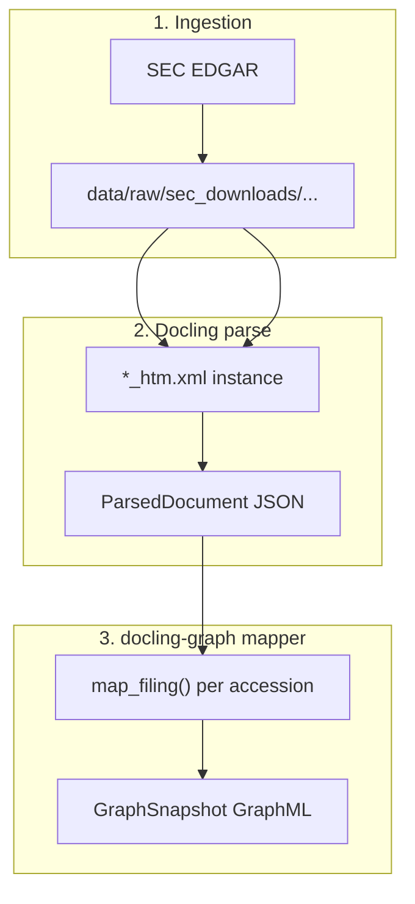
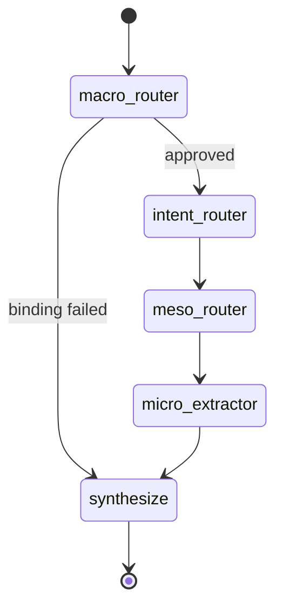
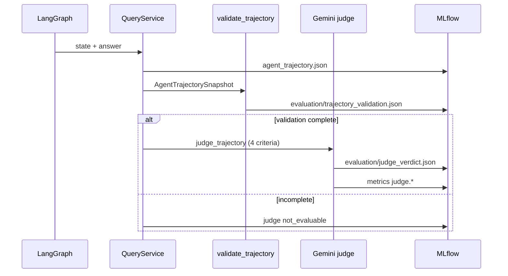

# End-to-end walkthrough: from EDGAR download to judged answer

This guide walks through a complete run for Apple (AAPL): **`materialize`** then **`ask`**, with emphasis on **XBRL**, **[Docling](https://github.com/docling-project/docling)**, and the **[docling-graph](https://github.com/docling-project/docling-graph)** schema. No prior knowledge of XBRL or these libraries is assumed.

**Example question we follow:**

> How did total net sales change year over year?

**Commands:**

```bash
uv run agent-query materialize --ticker AAPL
USE_MOCK_LLM=0 uv run agent-query ask --ticker AAPL --trace verbose \
  --query "How did total net sales change year over year?"
```

---

## Table of contents

1. [What problem are we solving?](#what-problem-are-we-solving)
2. [XBRL in plain English](#xbrl-in-plain-english)
3. [Official references and best practices](#official-references-and-best-practices)
4. [What Docling does here](#what-docling-does-here)
5. [What docling-graph means in this repo](#what-docling-graph-means-in-this-repo)
6. [Phase A: `materialize` — ingest, parse, build graph](#phase-a-materialize--ingest-parse-build-graph)
7. [Phase B: `ask` — agent, evidence, answer](#phase-b-ask--agent-evidence-answer)
8. [Phase C: Trajectory, validation, and judge](#phase-c-trajectory-validation-and-judge)
9. [How the data files connect](#how-the-data-files-connect)
10. [What to look at in MLflow](#what-to-look-at-in-mlflow)
11. [Glossary](#glossary)

---

## What problem are we solving?

Public companies file structured financial reports with the SEC. A **10-K** is an annual report; a **10-Q** is quarterly. Inside each filing is **XBRL**: machine-readable numbers and labels (revenue, assets, tax, etc.), not just a PDF story.

Our pipeline:

1. **Downloads** the filing package from EDGAR.
2. **Parses** XBRL with **Docling** into a normalized `ParsedDocument`.
3. **Builds a graph** using a **docling-graph–aligned** mapper (nodes and edges the agent can walk).
4. **Runs an agent** that picks filings, finds the right sections/facts, and answers in natural language—only from retrieved evidence.
5. **Records an auditable trajectory** and runs an external **judge** on that trajectory.

---

## XBRL in plain English

Think of XBRL as a **spreadsheet the SEC can verify**, attached to each filing.

| Idea | Plain meaning | Example |
|------|----------------|---------|
| **Concept** | Standard name for a line item | `RevenueFromContractWithCustomerExcludingAssessedTax` ≈ “net sales / revenue” |
| **Fact** | One number (or text) for that concept in a **specific period** | $391.04 billion for FY2024 |
| **Context / period** | Which dates the number applies to | `2023-10-01` to `2024-09-28` |
| **Instance document** | Main XML file listing all facts | `000032019324000123_htm.xml` |
| **Taxonomy / linkbases** | Dictionary and rules (`.xsd`, `_cal`, `_lab`, …) | Defines what “Revenue” means |

Companies do **not** invent random tag names for core items; they use US GAAP taxonomy labels. That is why the agent can search for **revenue** and land on a precise concept name in the graph.

**What you do *not* need for this walkthrough:** reading raw XML by hand. Docling + Arelle (inside `docling[xbrl]`) does that and gives us tables of facts we can turn into graph nodes.

---

## Official references and best practices

This repo builds on two open-source projects from the Docling ecosystem. Use these as the **source of truth** for library behavior; use this walkthrough for **how we wire them into SEC GraphRAG**.

| Library | Official docs | Role in this repo |
|---------|---------------|-------------------|
| **Docling** | [XBRL Document Conversion](https://docling-project.github.io/docling/examples/xbrl_conversion/) · [Docling repo](https://github.com/docling-project/docling) | Parse each EDGAR `*_htm.xml` instance → `DoclingDocument` → `ParsedDocument` |
| **docling-graph** | [docling-graph repo](https://github.com/docling-project/docling-graph) · [Documentation](https://docling-project.github.io/docling-graph/) | **Schema contract** for nodes/edges; we implement it in `docling_graph_mapper` |

### How our pipeline differs from the upstream tutorials

**Docling’s XBRL example** converts one instance file and inspects or exports a `DoclingDocument` (Markdown, JSON, key-value items). **We do the same conversion step**, then add SEC-specific steps: cache the full EDGAR package, consolidate facts per period, merge optional HTML narrative, and save `ParsedDocument` JSON.

**docling-graph’s quick start** often uses **Pydantic templates + LLM/VLM extraction** (`run_pipeline`, `docling-graph convert`) to build graphs from PDFs or reports. That path is ideal when structure is implicit in prose. **SEC XBRL is already structured**—numbers and taxonomy tags are explicit—so we use a **deterministic bridge**:

```text
Docling (XBRL)  →  ParsedDocument  →  docling_graph_mapper  →  GraphSnapshot
```

We still follow docling-graph’s design goals—**validated structure, explicit relationships, queryable graphs**—without running the LLM extraction pipeline on every filing. See [feature 004 research](../specs/004-docling-graph-materialization/research.md) (R1).

---

### Docling XBRL best practices (and how we apply them)

These follow the official [XBRL Document Conversion](https://docling-project.github.io/docling/examples/xbrl_conversion/) guide and our `configs/docling_xbrl.yaml` / `src/parsing/docling_xbrl.py`.

| Best practice | Why it matters | What we do |
|---------------|----------------|------------|
| **Install XBRL extra** | Arelle backend is required | `docling[xbrl]>=2.94.0` in `pyproject.toml` |
| **Keep instance + taxonomy together** | Validator needs `.xsd`, `_cal`, `_def`, `_lab`, `_pre` locally | Full package under `data/raw/sec_downloads/{ticker}/{accession}/` |
| **`enable_local_fetch=True`** | Docling must read taxonomy files from disk | Always set in `build_xbrl_converter()` |
| **Choose offline vs online taxonomy** | US-GAAP/DEFI schemas may reference URLs | Default `enable_remote_fetch: true` in `configs/docling_xbrl.yaml` for live SEC filings; use `false` + `taxonomy_package.zip` only for air-gapped runs (per Docling docs) |
| **Point `taxonomy=` at a directory of `.xsd`/linkbases** | Not at the zip bundle alone | `find_taxonomy_dir()` picks the folder with linkbases (excludes `*-xbrl.zip` paths that confuse Arelle) |
| **Use `InputFormat.XML_XBRL` only for instances** | Linkbase-only XML is not the entry file | `is_xbrl_instance_path()` skips `_cal.xml`, etc. |
| **Treat numeric output as key-value facts** | Docling exposes facts as KV items / tables | We build `xbrl-facts` table rows, then `consolidate_xbrl_fact_rows()` so **each period** stays a separate fact |
| **Respect `decimals` and `period`** | Raw integers are not human dollar amounts | `format_xbrl_numeric()` + `fact_to_excerpt()` before graph/LLM |

**Docling note (from upstream):** the XBRL backend currently flattens facts into key-value pairs; richer taxonomy context may improve in future Docling releases. We compensate by storing **`xbrl_concept`**, **`period`**, and **`currency`** on each `CHUNK_XBRL_FACT` node so retrieval stays precise.

**SEC-specific patch:** some Apple-style filings use **typed dimensions** that crash unpatched Docling; we apply a small runtime patch in `_apply_docling_xbrl_dimension_patch()` before convert.

Minimal Docling setup (equivalent to our converter):

```python
from pathlib import Path
from docling.datamodel.backend_options import XBRLBackendOptions
from docling.datamodel.base_models import InputFormat
from docling.document_converter import DocumentConverter, XBRLFormatOption

taxonomy_dir = Path("data/raw/sec_downloads/AAPL/0000320193-24-000123")  # folder with .xsd + linkbases
converter = DocumentConverter(
    allowed_formats=[InputFormat.XML_XBRL],
    format_options={
        InputFormat.XML_XBRL: XBRLFormatOption(
            backend_options=XBRLBackendOptions(
                enable_local_fetch=True,
                enable_remote_fetch=True,  # SEC/US-GAAP; set False only with taxonomy_package.zip
                taxonomy=taxonomy_dir,
            )
        )
    },
)
result = converter.convert(taxonomy_dir / "000032019324000123_htm.xml")
doc = result.document  # DoclingDocument — we then map this to ParsedDocument
```

---

### docling-graph best practices (and how we apply them)

From the [docling-graph project](https://github.com/docling-project/docling-graph): graphs should capture **exact entity connections** (instruments, properties, measurements) rather than relying only on fuzzy text embeddings—especially in **finance**.

| docling-graph principle | How we apply it in GraphRAG |
|-------------------------|----------------------------|
| **Pydantic-validated structure** | `ParsedDocument`, `GraphNode`, `GraphSnapshot` are Pydantic models; materialization **fail-closed** if a filing has no sections and no XBRL facts |
| **Stable, explicit node IDs** | `doc-{accession}-xbrl-{hash}` from concept + period; document and section ids are deterministic |
| **Typed edges with meaning** | `CONTAINS`, `NEXT`, `FOOTNOTE_OF`, `REFERENCES`, `TEMPORAL_TRANSITION` per [edge catalog](../specs/004-docling-graph-materialization/contracts/edge-catalog.md) |
| **Queryable graph export** | GraphML + manifest under `data/graphs/`; agent uses `LocalGraphQueryAPI` |
| **Do not over-collapse facts** | Materialize **every** `(concept, period)` instance (no 400-fact cap)—aligns with “precision over approximation” |
| **Audit traversability** | `graph-audit` / reachability report: ≥95% of XBRL/table chunks reachable in ≤6 **structural** hops |

**Agent navigation** uses structural `CONTAINS` walks (and `FOOTNOTE_OF` for table-linked footnotes)—the same edge families docling-graph promotes for faithful traversal. Optional `SEMANTIC_SIMILARITY` / thematic edges exist in config but are off by default in CI.

**When to use upstream docling-graph CLI instead:** exploratory graphs from **unstructured** PDFs or custom Pydantic templates (research prototypes, non-XBRL sources). For **EDGAR XBRL 10-K/10-Q**, stay on this repo’s `materialize` path so parsing and graph semantics stay aligned with SEC accessions and our agent.

---

## What Docling does here

**Docling** is a document conversion toolkit. For this project we use one specific capability (documented in the official [XBRL conversion example](https://docling-project.github.io/docling/examples/xbrl_conversion/)):

- **Input:** SEC **XBRL instance XML** (+ taxonomy files in the same folder).
- **API:** `DocumentConverter` with `InputFormat.XML_XBRL` (see `src/parsing/docling_xbrl.py`; mirrors the [official XBRL backend setup](https://docling-project.github.io/docling/examples/xbrl_conversion/#configure-xbrl-backend)).
- **Output:** A structured in-memory document we convert into our `ParsedDocument` JSON:
  - **Sections** (and optional HTML narrative: MD&A, risk factors).
  - **Tables**, including a special table `xbrl-facts` whose rows are key–value fact lines from Docling.
  - **Footnotes** (when present).

### Step-by-step: Docling inside `materialize`

```text
data/raw/sec_downloads/AAPL/0000320193-24-000123/
  ├── 000032019324000123_htm.xml    ← instance (Docling entry point)
  ├── 000032019324000123.xsd        ← taxonomy
  ├── *_cal.xml, *_def.xml, ...     ← linkbases
  └── manifest.json                 ← what we downloaded
```

1. **Ingestion** (`src/ingestion/`) fetches or reuses this folder; `manifest.json` records accession, form type, period end.
2. **`parse_from_cache`** (`src/parsing/sec_download_adapter.py`) calls **`parse_xbrl_package`** in `docling_xbrl.py`.
3. Docling reads the instance; fact rows appear as table cells (concept name, `value:…`, `period:…`, `currency:…`, `decimals:…`).
4. **`consolidate_xbrl_fact_rows`** (`src/parsing/xbrl_facts.py`) merges flat rows into one record per fact:

```text
Concept: RevenueFromContractWithCustomerExcludingAssessedTax
  value: 391035000000
  period: 2023-10-01 - 2024-09-28
  currency: USD
  decimals: -6
```

5. **`format_xbrl_numeric`** turns `391035000000` with `decimals: -6` into human text: **$391.04 billion** (values are often stored in millions at the SEC).
6. Result is saved as:

```text
data/parsed/AAPL/0000320193-24-000123.json   ← ParsedDocument
```

**Example excerpt string** the graph and LLM will see later (from `fact_to_excerpt`):

```text
XBRL RevenueFromContractWithCustomerExcludingAssessedTax: $391.04 billion USD for period 2023-10-01 - 2024-09-28
```

That string is stored on the graph node’s `source_ref` so retrieval stays **grounded in the filing**, not in model memory.

---

## What docling-graph means in this repo

**[docling-graph](https://github.com/docling-project/docling-graph)** turns documents into **validated, queryable knowledge graphs** with explicit semantic relationships—aimed at domains like finance where “about the same topic” is not good enough; you need **labeled connections** (document → section → fact, footnote → table, filing → filing over time).

We do **not** run `docling-graph convert` with LLM templates on each SEC filing. XBRL already gives us structured facts via Docling. Instead, **`docling_graph_mapper.map_filing()`** (`src/graph/docling_graph_mapper.py`) maps our **`ParsedDocument`** into `GraphNode` / `GraphEdge` types that follow the **docling-graph ER contract** (`DOCLING_GRAPH_MAPPER_VERSION`). That is the bridge described in [official references](#official-references-and-best-practices) above.

### Node types the agent cares about

| Node type | Role |
|-----------|------|
| `DOCUMENT` | One filing (one accession) |
| `SECTION` | Item / notes / **XBRL Financial Facts** bucket |
| `CHUNK_XBRL_FACT` | One tagged number (concept + period) |
| `CHUNK_TABLE` / `CHUNK_ROW` | Rendered financial tables |
| `CHUNK_PARAGRAPH` | Narrative text (HTML MD&A, etc.) |

### Edges

| Edge | Meaning |
|------|---------|
| `CONTAINS` | Parent holds child (doc → section → chunk) |
| `NEXT` | Reading order between sections |
| `FOOTNOTE_OF` | Footnote linked to a table |
| `TEMPORAL_TRANSITION` | Links FY2024 10-K document → FY2025 10-K document across the corpus |

After all filings in the corpus are mapped, **`build_snapshot`** (`src/graph/builder.py`) writes:

```text
data/graphs/AAPL/
  ├── index.json                              ← latest snapshot_id
  ├── {snapshot_id}.graphml                   ← full graph
  ├── {snapshot_id}.manifest.json             ← filings included
  └── {snapshot_id}.reachability.json         ← audit: can we reach XBRL from root?
```

**Reachability audit:** At least 95% of sampled XBRL/table chunks must be reachable from the document root within six structural hops—so the agent is not chasing disconnected noise.

---

## Phase A: `materialize` — ingest, parse, build graph



**Default corpus** (`configs/corpus.yaml`): about **two fiscal years** of Apple 10-Ks and 10-Qs (e.g. 2× annual + 8× quarterly, capped at 12 filings). For our YoY question, the important outcome is: **at least two 10-Ks** with XBRL revenue facts for consecutive fiscal years.

### Concrete graph shape for one XBRL fact (FY2024 10-K)

```text
doc-0000320193-24-000123                    [DOCUMENT]
  └── doc-0000320193-24-000123-xbrl-facts   [SECTION "XBRL Financial Facts"]
        └── doc-0000320193-24-000123-xbrl-adbf72cacf40   [CHUNK_XBRL_FACT]
              source_ref: "XBRL RevenueFromContract...: $391.04 billion USD for period ..."
              properties: { xbrl_concept, period, currency }
```

Every fact gets a **stable node id** derived from concept + period hash so the same economic number always maps to the same node in a given snapshot.

---

## Phase B: `ask` — agent, evidence, answer

`ask` loads the latest **GraphSnapshot** for AAPL and runs a **LangGraph** workflow (`src/retrieval/orchestration/graph.py`).



Each stage reads and writes **the same graph**; only the bound **accessions** (subset of documents) matter for your question.

### Stage 1 — Macro router (which filings?)

**Question:** “How did total net sales change year over year?”

**Behavior:**

- LLM proposes a **YoY** comparison on the **latest two annual 10-Ks** (unless you pre-bind with `--anchor` / `--period`).
- **Deterministic validator** (`src/retrieval/macro/validator.py`) checks accessions exist in the corpus manifest.

**Typical binding (verbose trace):**

```text
selected_accessions: ['0000320193-25-000079', '0000320193-24-000123']
comparison_mode: YoY
period_labels: FY2025, FY2024
```

**Data used:** `GraphSnapshot` manifest + filing metadata (period_end, form_type)—not XBRL numbers yet.

---

### Stage 2 — Intent router (numeric vs narrative?)

**Behavior:** Classifies the question as **`numeric`** → retrieval will prefer **XBRL facts** over HTML prose (`source_bias: xbrl_primary`).

**Data used:** Query text only; result is stored in `intent_trace` and logged to MLflow as `intent_router.json`.

---

### Stage 3 — Meso router (which sections?)

**Default:** **TOC planner** (`configs/graph_navigation.yaml` → `meso.discovery_mode: toc_planner`).

For each bound filing, the agent builds a **table of contents** from SECTION nodes (including `narrative_kind`: `xbrl_bucket`, `md_and_a`, `risk_factors`, …). An LLM ranks section node ids.

**For YoY net sales (typical trace):**

```text
toc_planner (xbrl_bucket): 2 section(s)
top_section_ids:
  - doc-0000320193-25-000079-xbrl-facts
  - doc-0000320193-24-000123-xbrl-facts
```

**Why XBRL bucket?** Numeric sales questions should not start in Item 1A risk factors; the TOC prompt explicitly steers revenue questions to **`xbrl_bucket`** first.

**Data used:** SECTION nodes and labels from the **docling-graph mapper**—still no free-text answer.

---

### Stage 4 — Micro extractor (which chunks / facts?)

Within each chosen section, the walker collects **chunk node ids** under `CONTAINS` (and footnotes via `FOOTNOTE_OF` when linked to tables).

For **financial queries** in the XBRL bucket, chunks are **narrowed** to concepts matching the query (e.g. revenue / net sales) using `xbrl_concept` on `CHUNK_XBRL_FACT` nodes (`src/parsing/xbrl_facts.py` helpers).

**Typical evidence (abbreviated):**

| Score | Chunk node | What it is |
|-------|------------|------------|
| 46.5 | `doc-...-25-000079-xbrl-f31f441fd33c` | FY2025 revenue fact |
| 46.5 | `doc-...-24-000123-xbrl-f31f441fd33c` | FY2024 revenue fact |

Each `EvidenceChunk` carries:

- `excerpt` — the `fact_to_excerpt` text from Docling/XBRL.
- `accession`, `section_id`, `content_hash`.
- Navigation path metadata (`CONTAINS` chain).

**Data used:** `CHUNK_XBRL_FACT` nodes created by **docling_graph_mapper** from Docling’s `xbrl-facts` table.

---

### Stage 5 — Synthesize (natural language answer)

Top evidence (up to budget in `configs/lm_studio.yaml`) is sent to the **local LLM** (LM Studio) with instructions: use **only** these excerpts and name the fiscal periods.

**Example answer:**

```text
Total net sales increased year over year, from $391.04 billion in FY2024 to
$416.16 billion in FY2025 (+$25.12 billion, +6.4%), per
RevenueFromContractWithCustomerExcludingAssessedTax in the bound 10-K filings.
```

**Data used:** `EvidenceChunk.excerpt` strings—still traceable to specific **XBRL graph nodes** and thus to Docling-parsed facts.

---

## Phase C: Trajectory, validation, and judge

After LangGraph finishes, **`QueryService`** (`src/retrieval/service.py`) runs **outside** the graph but **inside the same MLflow run**:



### What is in `agent_trajectory.json`?

Built by `build_agent_trajectory_snapshot()` (`src/tracing/trajectory_export.py`):

| Field | Content |
|-------|---------|
| `plan` | Macro intent, binding steps, rationale |
| `document_route` | Bound accessions, `filed_at`, fiscal labels |
| `graph_traversal` | Meso/micro hops (section and chunk node ids, `CONTAINS`) |
| `evidence` | Chunk ids, hashes, whether each was in the synthesis prompt |
| `evaluation_as_of` | Date used when judging (avoids “future filing” confusion) |

### Validator

`validate_trajectory()` (`src/evaluation/validator/trajectory.py`) checks schema, hashes, and that hop/evidence accessions match the document route.

| Status | Judge runs? |
|--------|-------------|
| `complete` | Yes |
| `incomplete` | No (`not_evaluable`) |
| `non_reproducible` | No (e.g. orphan accession prefix) |

### Judge (Gemini)

When validation is `complete`, **`run_post_query_audit()`** calls **Gemini 2.5 Pro** with the trajectory JSON and rubrics (`configs/judges/gemini_2_5_pro.yaml`):

| Criterion | Question it answers |
|-----------|---------------------|
| `trajectory_coherence` | Does plan → route → hops → evidence tell one story? |
| `routing_decisions` | Were the right filings and sections chosen? |
| `retrieval_fidelity` | Does evidence match the question and bound filings? |
| `synthesis_grounding` | Is the answer supported by cited excerpts? |

**Console footer (`--trace normal` or `verbose`):**

```text
validation: complete
judge: ok (gemini-2.5-pro)
  trajectory_coherence: 0.92
  routing_decisions: 1.00
  retrieval_fidelity: 1.00
  synthesis_grounding: 1.00
```

### LangGraph tracing vs audit artifacts

| Mechanism | What you see |
|-----------|----------------|
| **MLflow Traces** | Spans for LLM calls (macro, intent, TOC planner, synthesis) |
| **MLflow Metrics** | `judge.trajectory_coherence`, etc. |
| **MLflow Artifacts** | `agent_trajectory.json`, `evaluation/judge_verdict.json`, `macro_binding.json`, `navigation_trace.json` |
| **stderr trace** | Rich panels per stage when `--trace verbose` |

---

## How the data files connect

One accession **0000320193-24-000123** (Apple FY2024 10-K):

```text
EDGAR package          Docling parse              Graph node
─────────────────────────────────────────────────────────────────
*_htm.xml        →     ParsedDocument.json   →    doc-...-xbrl-{hash}
  (XBRL facts)         tables[xbrl-facts]         CHUNK_XBRL_FACT
                       rows → consolidate          source_ref = excerpt
```

Multi-filing **ask** connects two such chains:

```text
FY2025 10-K  doc-0000320193-25-000079-xbrl-*  ─┐
                                               ├─► EvidenceChunks ─► LLM ─► Answer
FY2024 10-K  doc-0000320193-24-000123-xbrl-*  ─┘
         ▲                           ▲
         │                           │
    Docling parse               docling_graph_mapper
    (per filing)                (per filing)
```

---

## What to look at in MLflow

```bash
uv run mlflow ui --backend-store-uri sqlite:///mlflow.db
```

Open the latest **`ask`** run:

1. **Metrics** — `judge.*` scores.
2. **Artifacts → `evaluation/`** — `judge_verdict.json` (per-criterion justifications), `trajectory_validation.json`.
3. **Artifacts → `agent_trajectory.json`** — full auditable path.
4. **Traces** — LLM span timeline (macro / meso TOC / synthesis).

---

## Glossary

| Term | Short definition |
|------|------------------|
| **Accession** | SEC id for one filing (e.g. `0000320193-24-000123`) |
| **Docling** | Library that parses XBRL instance XML into structured tables/text |
| **docling-graph** | ER schema for document graphs; we implement it in `docling_graph_mapper` |
| **ParsedDocument** | Our JSON parse result before graph build |
| **GraphSnapshot** | Versioned multi-filing graph (GraphML + manifest) |
| **XBRL fact** | One tagged value for a concept in a period |
| **xbrl_bucket** | SECTION that holds all `CHUNK_XBRL_FACT` nodes for a filing |
| **Trajectory** | Snapshot of plan, route, hops, and evidence for audit/judge |

---

## Related docs

- [README](../README.md) — two workflows (interactive `ask` vs paper `repro`)
- [Research reproduction](research-reproduction.md) — custom-judge benchmark, five variants, defer-judge
- [Documentation index](README.md)
- [Navigation trace checklist](navigation-trace-usability-checklist.md)
- [Feature 010 spec](../specs/010-mlflow-trajectory-judge-eval/spec.md) — trajectory and judge requirements
- [XBRL retrieval research](../specs/002-live-disclosure-cli/research-xbrl-retrieval.md) — design rationale for XBRL-first routing

### External (Docling ecosystem)

- [Docling: XBRL Document Conversion](https://docling-project.github.io/docling/examples/xbrl_conversion/) — taxonomy layout, `XBRLBackendOptions`, key-value facts
- [Docling GitHub](https://github.com/docling-project/docling)
- [docling-graph GitHub](https://github.com/docling-project/docling-graph) — graph principles, templates, `run_pipeline` (contrast with our deterministic SEC bridge)
- [docling-graph documentation](https://docling-project.github.io/docling-graph/)
